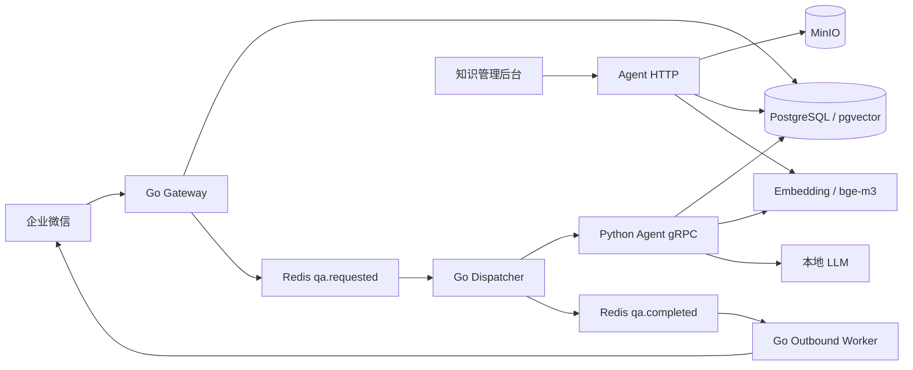

# 企业微信智能知识 Agent

面向企业内部知识问答的可运行 MVP：员工从企业微信提问，系统按照用户权限检索企业知识库，调用本地大模型生成带来源引用的回答，再发送回企业微信。

项目采用 Go + Python 的服务化结构，默认支持 PostgreSQL/pgvector、Redis、MinIO，以及 Ollama、vLLM 等 OpenAI-compatible 本地模型服务。

## 当前能力

- 企业微信回调验签、AES 解密、消息幂等处理
- 企业微信用户自动映射和会话管理
- Redis Stream 异步任务分发与 Pending 消息回收
- Python gRPC Agent 服务
- 用户、角色、部门及全员知识库 ACL 过滤
- 中文 n-gram 关键词检索、pgvector 向量检索和 RRF 融合
- Qwen、DeepSeek、Llama 等 OpenAI-compatible 模型接入
- 模型不可用时的抽取式降级回答
- 回答、模型、检索配置和引用来源持久化
- PDF、DOCX、XLSX、Markdown、TXT、CSV 文档上传与切片
- 原始文档存储到 MinIO
- 内部知识管理后台：运行概览、知识库筛选、文档上传、版本历史和停用/恢复
- 本地 LLM、Embedding 在线检测及可恢复的后台向量重建任务
- RAG 批量评测：真实 ACL、关键词/来源期望、拒答校验、质量指标与延迟分位数
- 企业微信 access token 缓存、重复发送保护和可靠投递记录
- Docker Compose 本地运行环境

## 系统链路



问答流程：

1. Gateway 验证并解密企业微信消息。
2. 消息与用户身份写入 PostgreSQL，并发布 `qa.requested`。
3. Dispatcher 调用 Agent gRPC 服务。
4. Agent 根据实时 ACL 检索知识块，调用本地模型并保存答案、引用。
5. Dispatcher 发布 `qa.completed`。
6. Outbound Worker 将带来源的回答发送回企业微信。

## 快速启动

### 环境要求

- Docker 28+
- Docker Compose 2.34+
- Go 1.25+（本地开发、测试时需要）
- Python 3.12+ 和 uv（本地开发、测试时需要）

### 1. 准备配置

首次运行时复制环境变量模板：

```bash
cp .env.example .env
```

不配置企业微信和模型也可以启动核心服务。此时企业微信入口关闭，模型调用失败时使用关键词检索与抽取式回答。

### 2. 启动核心服务

```bash
make up
```

启动的服务包括：

| 服务 | 本机地址 |
| --- | --- |
| Gateway | `http://127.0.0.1:18080` |
| Agent HTTP | `http://127.0.0.1:8081` |
| Agent gRPC | `127.0.0.1:50051` |
| PostgreSQL | `127.0.0.1:15432` |
| Redis | `127.0.0.1:6379` |
| MinIO API | `http://127.0.0.1:19000` |
| MinIO Console | `http://127.0.0.1:19001` |

检查服务状态：

```bash
curl http://127.0.0.1:18080/health/ready
curl http://127.0.0.1:8081/internal/v1/health/ready
docker compose ps
```

### 3. 使用知识管理后台

浏览器访问：

```text
http://127.0.0.1:8081/admin
```

管理员令牌读取 `.env` 中的 `AGENT_ADMIN_TOKEN`。验证成功后可查看运行统计、模型连接和存储健康状态，并完成：

- 按知识库、状态或关键词检索文档
- 上传新文档，为已有文档发布新版本
- 查看文档详情、索引状态和版本历史
- 软停用或恢复文档的 RAG 检索，不删除 MinIO 原文件
- 为单个文档重建向量，或一键补齐全部缺失向量
- 创建最多 20 道题的 RAG 评测集，并导出 JSON 结果

令牌仅保存在当前浏览器的 `sessionStorage`，关闭当前会话后需要重新登录。生产环境必须替换模板值，并通过内网或反向代理访问控制保护后台。

也可以通过命令行上传示例文档：

```bash
make upload-example
```

也可以直接上传自己的文件：

```bash
curl --fail-with-body -X POST http://127.0.0.1:8081/internal/v1/documents \
  -H "X-Internal-Token: local-dev-token" \
  -F "knowledge_base_id=00000000-0000-0000-0000-000000000101" \
  -F "title=客户开户指引" \
  -F "source_code=customer-opening" \
  -F "file=@/path/to/document.pdf"
```

如需给已有文档创建新版本，在表单中增加 `document_id`。

### 4. 查看日志或停止服务

```bash
make logs
make down
```

`make down` 不删除 PostgreSQL、Redis 和 MinIO 数据卷。

## 接入本地模型

Agent 使用 OpenAI-compatible API。默认连接宿主机的 `11434` 端口，适用于本机 Ollama：

```dotenv
LLM_BASE_URL=http://host.docker.internal:11434/v1
LLM_API_KEY=local
LLM_MODEL=Qwen3.5-4B

EMBEDDING_BASE_URL=http://host.docker.internal:11434/v1
EMBEDDING_API_KEY=local
EMBEDDING_MODEL=bge-m3
```

模型名称必须与本地实际部署的名称一致。使用 vLLM 或其他兼容服务时，只需替换 URL、API Key 和模型名。

Embedding 输出维度默认为 `1024`，应与数据库中的 `vector(1024)` 保持一致。

后台“模型与索引”区域会实际调用 Embedding 接口并检查输出维度，同时通过 OpenAI-compatible `/models` 接口确认 LLM 是否存在。模型可用后，可以：

- 在工作台或文档页点击“补齐向量”，仅处理当前版本中缺失向量的文档。
- 在单个文档的列表或详情中点击“重建”，强制重新生成该文档当前版本的全部向量。
- 查看排队、处理中、等待重试、成功和失败状态。

重建任务持久化在 PostgreSQL 中，Agent HTTP 重启后可以重新领取。临时模型故障会自动重试 3 次；重建只原子更新当前知识块的向量，不会复制 MinIO 文件或增加文档版本。

## RAG 性能评测

在管理后台左侧进入“RAG 评测”，可以逐题配置：

- 问题和期望答案关键词
- 期望命中的来源文档标题
- 该问题是否应因缺少依据而拒答
- 可选知识库范围和真实 ACL 用户 ID

留空用户 ID 时，系统会创建专用的普通评测用户。该用户仍执行真实 ACL，只能访问向全员开放的知识；指定真实用户 ID 时，可评测部门、角色或个人授权范围。

每批最多 20 题并顺序执行，避免本地模型被突发并发压垮。报告包含通过率、引用率、关键词召回、来源命中、拒答准确率、错误数、平均延迟、P50、P95 和吞吐量。每次评测会走与企业微信问答相同的 Query Service，并持久化问题、回答和引用；批次汇总当前在浏览器展示，可导出为 JSON。

## 接入企业微信

在 `.env` 中填写：

```dotenv
WECOM_CORP_ID=
WECOM_AGENT_ID=
WECOM_CALLBACK_TOKEN=
WECOM_ENCODING_AES_KEY=
WECOM_CORP_SECRET=
```

企业微信应用的回调地址配置为：

```text
https://你的域名/callbacks/wecom
```

生产环境应通过 HTTPS 反向代理到 Gateway 容器的 `8080` 端口。填写配置后启动包含出站服务的完整链路：

```bash
make up-wecom
```

普通 `make up` 不会启动 Outbound Worker，避免在凭据不完整时误发消息。

## 常用接口

| 方法 | 路径 | 用途 |
| --- | --- | --- |
| `GET` | `/health/live` | Gateway 存活检查 |
| `GET` | `/health/ready` | Gateway PostgreSQL/Redis 就绪检查 |
| `GET` | `/callbacks/wecom` | 企业微信回调 URL 验证 |
| `POST` | `/callbacks/wecom` | 接收企业微信加密消息 |
| `GET` | `/internal/v1/health/live` | Agent HTTP 存活检查 |
| `GET` | `/internal/v1/health/ready` | Agent PostgreSQL/MinIO 就绪检查 |
| `GET` | `/admin` | 内部知识管理后台 |
| `GET` | `/internal/v1/admin/overview` | 后台运行概览 |
| `GET` | `/internal/v1/admin/knowledge-bases` | 后台知识库列表 |
| `GET` | `/internal/v1/admin/models/status` | LLM 与 Embedding 实际连接状态 |
| `POST` | `/internal/v1/admin/rag/evaluate` | 批量执行真实 RAG 评测 |
| `GET` | `/internal/v1/admin/documents` | 后台文档检索与分页 |
| `GET` | `/internal/v1/admin/documents/{id}` | 文档详情和版本历史 |
| `PATCH` | `/internal/v1/admin/documents/{id}/state` | 软停用或恢复文档 |
| `POST` | `/internal/v1/admin/documents/{id}/reindex` | 重建单个文档向量 |
| `POST` | `/internal/v1/admin/reindex` | 批量创建向量补建任务 |
| `GET` | `/internal/v1/admin/reindex/jobs` | 查询向量重建任务进度 |
| `POST` | `/internal/v1/documents` | 内部知识文档上传 |

`/internal/v1/admin/*` 与文档上传接口均使用 `X-Internal-Token`，其值由 `AGENT_ADMIN_TOKEN` 配置。

## 本地开发与测试

安装依赖并重新生成 protobuf：

```bash
make bootstrap
```

运行全部检查：

```bash
make test
```

测试范围包括：

- 企业微信签名、AES 解密及回调处理
- 企业微信 API token 缓存与消息发送
- 出站内容长度和 UTF-8 截断
- Agent 请求校验、拒答、RRF、引用重编号和降级回答
- 文档解析、切片及无 Embedding 模式导入
- 管理后台鉴权、模型探测、查询过滤、状态切换和可恢复向量重建任务
- RAG 评测 ACL 用户、质量指标、延迟分位数和接口校验

## 项目结构

```text
.
├── cmd/
│   ├── gateway/             # 企业微信入口
│   ├── dispatcher/          # qa.requested 消费与 Agent 调用
│   └── outbound/            # 企业微信回答发送
├── internal/
│   ├── agentclient/         # Go gRPC 客户端
│   ├── httpapi/             # Gateway HTTP 路由
│   ├── outbound/            # 出站内容格式化
│   ├── queue/               # Redis Stream
│   ├── store/               # PostgreSQL 数据访问
│   └── wecom/               # 企业微信加解密与 API 客户端
├── agent/
│   ├── src/agent/           # Python Agent、RAG、文档导入与管理后台
│   └── tests/
├── migrations/              # PostgreSQL 初始化迁移
├── proto/                   # gRPC 协议
├── examples/knowledge/      # 示例知识文档
└── docker-compose.yml
```

## MVP 边界

- 企业微信入口当前只处理文本消息；图片、文件消息和 OCR 尚未接入。
- 支持 `.pdf`、`.docx`、`.xlsx`、`.md`、`.txt`、`.csv`；旧版 `.doc`、`.xls` 需先转换。
- 企业微信通讯录同步尚未实现，首次提问用户会自动建立本地映射。
- 当前后台使用租户级单一管理员令牌，尚未提供多管理员账号、细粒度后台 RBAC 和审计操作页。
- Compose 模板密码和管理员令牌只适合本地开发，生产部署前必须更换。

更详细的接口和架构约定位于 [`docs/`](docs/)。
