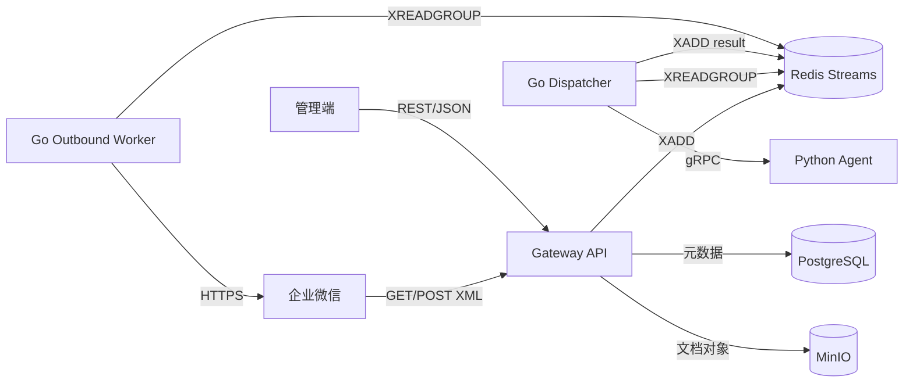

# 企业微信智能知识 Agent 平台——Go Gateway API 接口文档（V1.0）

## 1. 文档信息

| 项目 | 内容 |
| --- | --- |
| 文档版本 | V1.0 |
| 文档状态 | MVP 研发基线草案 |
| 上游设计 | 《系统详细设计（V1.0）》 |
| 服务实现 | Go + Gin + gRPC Client |
| API 风格 | REST/JSON、企业微信 XML、Redis Stream Event |

### 1.1 目的

本文档定义 Go Gateway 的外部和内部接口契约，供 Gateway、管理端、Python Agent、测试及运维共同使用。字段级数据库约束和 Python Agent 内部实现不在本文展开。

### 1.2 Gateway 职责

- 接收并验证企业微信回调；
- 把外部 XML 转换为内部标准事件；
- 提供管理端 REST API；
- 完成用户认证、管理权限校验、知识读取权限入口校验和限流；
- 保存上传文件并发布文档索引任务；
- 通过 gRPC 调用 Python Agent；
- 调用企业微信应用消息 API 发送答案；
- 记录请求链路、操作审计和安全事件。

### 1.3 非目标

- Gateway 不执行文档解析、Embedding、检索、Rerank 或 LLM 推理；
- Gateway 不相信客户端传入的部门、角色或 `tenant_id`；
- Gateway 不在企业微信回调请求内同步等待 LLM；
- Gateway 不向管理端暴露模型服务、Redis、MinIO 或数据库地址；
- 本版本不支持图片理解、文件消息直接问答和流式企业微信回复。

## 2. 接口全景



| 边界 | 协议 | 调用方向 | 身份机制 |
| --- | --- | --- | --- |
| 企业微信回调 | HTTPS + 加密 XML | 企业微信 → Gateway | 签名、时间戳、AES、CorpID/AgentID |
| 管理端 API | HTTPS + JSON/multipart | 管理端 → Gateway | Bearer Token + 本地权限 |
| Agent API | gRPC + protobuf | Dispatcher/Gateway → Agent | 服务身份 + mTLS/TLS |
| 异步任务 | Redis Streams | Gateway/Worker/Agent Worker | Redis 服务凭据 + 网络隔离 |
| 企业微信发送 | HTTPS + JSON | Outbound Worker → 企业微信 | `access_token` |

## 3. 通用 REST 约定

### 3.1 基础路径与版本

- 管理 API 前缀：`/api/v1`；
- 企业微信回调路径：`/callbacks/wecom`；
- 健康检查：`/health/live`、`/health/ready`；
- 指标端点：`/metrics`，仅允许监控网络访问；
- API 主版本通过路径管理，新增可选字段不提升主版本。

单企业 MVP 使用固定回调路径。若未来一个部署承载多个企业或多套不同 AES 密钥，再引入 `/callbacks/wecom/{integration_id}`，不得把可枚举的 `corp_id` 直接作为公开路径参数。

### 3.2 编码与命名

- JSON 使用 UTF-8；
- JSON 字段和查询参数使用 `snake_case`；
- 枚举值使用大写下划线，如 `IN_PROGRESS`；
- 资源 ID 使用 UUID 字符串，不接受数据库自增 ID；预置角色等明确标注的系统代码除外；
- 时间使用 RFC 3339 UTC，例如 `2026-08-06T13:30:00Z`；
- 日期使用 ISO 8601，例如 `2026-08-06`；
- 金额、百分比等未来业务字段不得使用不明确的浮点语义。

### 3.3 Content-Type

| 场景 | 请求 | 响应 |
| --- | --- | --- |
| REST JSON | `application/json` | `application/json; charset=utf-8` |
| 文档上传 | `multipart/form-data` | `application/json; charset=utf-8` |
| 企业微信回调 | `application/xml` 或 `text/xml` | `text/plain; charset=utf-8` |
| 健康检查 | 无要求 | `application/json; charset=utf-8` |

### 3.4 通用请求头

| 请求头 | 必填范围 | 说明 |
| --- | --- | --- |
| `Authorization: Bearer <token>` | 管理 API | 企业 SSO/OIDC 访问令牌 |
| `X-Request-ID` | 可选 | 客户端请求 ID；不合法时由 Gateway 重建 |
| `Idempotency-Key` | 创建、更新、删除和异步动作 API | 8～128 个可打印 ASCII 字符；下载地址接口除外 |
| `If-Match` | 更新/删除现有资源 | 使用资源响应中的 ETag |
| `traceparent` | 可选 | W3C Trace Context |
| `Accept-Language` | 可选 | MVP 支持 `zh-CN`，未提供时使用中文 |

Gateway 总是返回 `X-Request-ID`，并透传或创建 `traceparent`。不得把 `tenant_id`、角色或部门作为可由客户端控制的请求头。

### 3.5 成功响应

单资源：

```json
{
  "data": {
    "id": "0198...",
    "name": "公司制度库"
  },
  "request_id": "01J..."
}
```

列表：

```json
{
  "data": [],
  "page": {
    "next_cursor": null,
    "has_more": false
  },
  "request_id": "01J..."
}
```

异步任务：

```json
{
  "data": {
    "job_id": "0198...",
    "job_type": "DOCUMENT_INDEX",
    "status": "QUEUED"
  },
  "request_id": "01J..."
}
```

### 3.6 错误响应

```json
{
  "error": {
    "code": "DOCUMENT_UNSUPPORTED_TYPE",
    "message": "当前不支持该文件类型",
    "details": [
      {
        "field": "file",
        "reason": "仅支持 pdf、docx、xlsx、md、txt"
      }
    ]
  },
  "request_id": "01J..."
}
```

- `message` 可以展示给用户，但不包含内部堆栈、SQL、对象键和模型地址；
- `details` 只用于可修正的字段错误，生产环境不返回调试信息；
- 错误码是稳定契约，客户端不得依赖自然语言 `message` 判断逻辑。

### 3.7 分页、排序与过滤

- 使用不透明游标分页：`cursor`、`limit`；
- `limit` 默认 20，最大 100；
- 默认排序为 `created_at DESC, id DESC`；
- 仅支持端点明确列出的过滤和排序字段；
- 客户端不得解析 `cursor` 内容；
- 删除或新增数据时，游标分页允许弱一致读取，不保证列表快照。

### 3.8 ETag 与并发更新

可修改资源返回：

```http
ETag: "7"
```

其中数值对应资源并发控制版本。响应中的 `version` 表示这一数值，文档业务版本另用 `version_number`。更新请求必须携带 `If-Match: "7"`。版本不一致返回 `412 PRECONDITION_FAILED` 和 `RESOURCE_VERSION_MISMATCH`，防止管理员之间静默覆盖。

## 4. 身份认证与权限

### 4.1 管理端身份契约

MVP 的 API 契约假定上游提供符合 OIDC/OAuth 2.0 语义的 Bearer Token。具体 SSO 厂商待部署设计确定，Gateway 的验证要求固定为：

- 校验签名、`iss`、`aud`、`exp`、`nbf`；
- 使用允许列表限制签名算法，禁止接受 `none`；
- 以 `sub` 映射本地用户；
- `tenant_id`、平台角色、部门和知识权限从本地数据库加载；
- Token 中携带的同名权限字段不得覆盖本地权限；
- 用户处于 `DISABLED` 或未同步状态时拒绝访问。

本地开发可以使用独立的开发身份提供器，不在生产代码中加入“跳过认证”开关。

### 4.2 企业微信消息身份

企业微信消息中的 `FromUserName` 是外部 `wecom_user_id`。Gateway 根据当前企业映射本地 `users.id`：

1. 找到有效用户：生成内部问答请求；
2. 用户不存在：可靠保存待解析消息并创建异步身份解析任务，不在回调请求内调用通讯录 API；
3. 异步解析成功：补全本地用户后继续发布原问答任务；
4. 查询失败或用户禁用：不进入 Agent，发送通用身份异常提示并记录审计；
5. 不把客户端消息里的部门或角色字段作为授权依据。

### 4.3 预置角色

| 角色 | 能力 |
| --- | --- |
| `platform_admin` | 平台配置、组织同步、角色管理、全局审计和知识库管理 |
| `kb_admin` | 被授权知识库的文档、版本和 ACL 管理 |
| `auditor` | 审计元数据与效果指标只读访问 |
| `employee` | 在文档 ACL 范围内问答和查看本人历史 |

管理权限和正文读取权限分离。`platform_admin` 或 `kb_admin` 可以管理资源元数据，不代表其一定能下载或查询文档正文。

### 4.4 权限动作

Gateway 内部使用稳定动作名：

```text
kb:create
kb:read_metadata
kb:update
kb:manage_acl
document:create
document:read_metadata
document:read_content
document:update
document:delete
document:reindex
chat:query
conversation:read_own
directory:read
directory:sync
role:assign
audit:read
```

权限校验失败统一返回 `403 FORBIDDEN`。为避免枚举敏感资源，用户对资源既无管理权也无读取权时，资源详情接口可以返回 `404 RESOURCE_NOT_FOUND`。

## 5. 企业微信回调接口

### 5.1 `GET /callbacks/wecom`——验证回调 URL

查询参数：

| 参数 | 必填 | 说明 |
| --- | --- | --- |
| `msg_signature` | 是 | 企业微信消息签名 |
| `timestamp` | 是 | Unix 秒级时间戳 |
| `nonce` | 是 | 随机字符串 |
| `echostr` | 是 | 加密验证字符串 |

处理顺序：

1. 检查参数长度、格式和时间戳允许偏差；
2. 使用配置中的 Token 校验签名；
3. 使用 EncodingAESKey 解密 `echostr`；
4. 校验解密内容中的接收方 ID；
5. 以纯文本原样返回解密结果，不添加 JSON、引号、BOM 或换行。

GET 验签时参与签名计算的密文项是未解密的 `echostr`。

成功响应：

```http
HTTP/1.1 200 OK
Content-Type: text/plain; charset=utf-8

1234567890
```

| 场景 | HTTP 状态 | 外部响应 |
| --- | ---: | --- |
| 验证成功 | 200 | 解密后的 `echostr` |
| 缺少/非法参数 | 400 | 空响应 |
| 签名失败 | 403 | 空响应 |
| 解密或接收方校验失败 | 400 | 空响应 |
| 服务配置不可用 | 503 | 空响应 |

企业微信回调错误不返回内部错误 JSON，详细原因只写入脱敏日志。

### 5.2 `POST /callbacks/wecom`——接收消息和事件

查询参数：

| 参数 | 必填 | 说明 |
| --- | --- | --- |
| `msg_signature` | 是 | 企业微信消息签名 |
| `timestamp` | 是 | Unix 秒级时间戳 |
| `nonce` | 是 | 随机字符串 |

外层加密 XML 示例：

```xml
<xml>
  <ToUserName><![CDATA[ww_corp_placeholder]]></ToUserName>
  <Encrypt><![CDATA[encrypted_payload_placeholder]]></Encrypt>
  <AgentID><![CDATA[1000002]]></AgentID>
</xml>
```

解密后的文本消息示例：

```xml
<xml>
  <ToUserName><![CDATA[ww_corp_placeholder]]></ToUserName>
  <FromUserName><![CDATA[zhangsan]]></FromUserName>
  <CreateTime>1786023000</CreateTime>
  <MsgType><![CDATA[text]]></MsgType>
  <Content><![CDATA[报销流程是什么？]]></Content>
  <MsgId>1234567890123456</MsgId>
  <AgentID>1000002</AgentID>
</xml>
```

安全解析要求：

- 请求体大小默认不超过 1 MiB，并支持配置；
- XML 解析器禁用 DTD、外部实体和网络访问；
- 在 AES 解密前先校验消息签名，比较操作使用恒定时间实现；
- 时间戳默认允许偏差为 ±300 秒；
- 解密后校验 CorpID 和 AgentID 与当前集成配置一致；
- 不把原始 XML、明文消息或密钥写入普通日志。

签名与加密算法必须与企业微信官方协议一致：

- 签名为 Token、`timestamp`、`nonce`、密文按字典序排序并拼接后的 SHA-1 小写十六进制值；
- EncodingAESKey 补齐 Base64 padding 后解码为 32 字节 AES Key；
- 使用 AES-256-CBC，IV 为 AES Key 的前 16 字节，并按企业微信定义的 PKCS#7 块大小处理填充；
- 解密内容按“16 字节随机数 + 4 字节网络序消息长度 + 消息正文 + ReceiveID”解析；
- ReceiveID 必须与配置的 CorpID 一致。

优先使用经过企业微信协议测试向量验证的独立加解密包，业务 Handler 不自行拼装密码学细节。

### 5.3 回调处理顺序

```text
读取有限请求体
  → 安全解析外层 XML
  → 校验签名和时间戳
  → AES 解密并校验接收方
  → 安全解析内层 XML
  → 标准化消息
  → 解析本地用户或创建身份解析任务
  → 幂等创建请求
  → 已知用户：可靠写入 qa.requested
  → 未知用户：可靠写入 directory.user.resolve.requested
  → 返回 200 success
```

只有对应问答任务或身份解析任务已可靠持久化后才返回成功。如果 Redis 不可用且没有持久化降级路径，Gateway 返回 503，让企业微信按平台策略重试；不得先返回成功再丢弃消息。

### 5.4 内部标准消息

企业微信 XML 转换后的内部结构：

```json
{
  "schema_version": "1.0",
  "request_id": "01J...",
  "tenant_id": "0198...",
  "channel": "WECOM",
  "integration_id": "0198...",
  "external_message_id": "1234567890123456",
  "external_user_id": "zhangsan",
  "actor_user_id": "0198...",
  "conversation_id": "0198...",
  "message_type": "TEXT",
  "content": "报销流程是什么？",
  "received_at": "2026-08-06T13:30:00Z",
  "trace_id": "4bf92f..."
}
```

字段约束：

| 字段 | 约束 |
| --- | --- |
| `request_id` | Gateway 生成，全链路唯一 |
| `tenant_id` | 从集成配置解析，不取自 XML 自定义字段 |
| `external_message_id` | 文本消息使用 `MsgId` |
| `actor_user_id` | 本地用户 UUID |
| `conversation_id` | 当前用户和渠道的活动会话；可按超时规则新建 |
| `content` | 去除首尾空白后 1～4000 个 Unicode 字符，阈值可配置 |
| `trace_id` | OpenTelemetry Trace ID |

### 5.5 回调幂等

文本消息幂等键：

```text
sha256(tenant_id + ":" + agent_id + ":" + msg_id)
```

没有 `MsgId` 的事件使用：

```text
sha256(tenant_id + ":" + agent_id + ":" + from_user + ":" +
       create_time + ":" + event + ":" + event_key)
```

- 幂等键具有数据库唯一约束或等价的原子写保护；
- 企业微信合法重试返回 `200 success`，但不重复入队；
- 幂等记录保存入队状态；若前次已持久化但尚未可靠入队，重试请求继续发布原任务而不是新建任务；
- 重复请求沿用原 `request_id` 记录审计；
- 幂等记录保留时间不得短于企业微信最大重试窗口，默认保留 7 天。

### 5.6 支持的消息类型

| `MsgType` | MVP 行为 |
| --- | --- |
| `text` | 创建问答任务 |
| `image` | 确认接收，异步回复“暂不支持图片消息” |
| `file` | 确认接收，异步回复“请通过知识库管理端上传文档” |
| `event` | 按事件允许列表处理；未知事件只记录类型并确认接收 |
| 其他 | 确认接收并按配置发送不支持提示，不进入 Agent |

不支持的合法消息不得返回 4xx 触发企业微信无意义重试。

### 5.7 回调响应

正常确认：

```http
HTTP/1.1 200 OK
Content-Type: text/plain; charset=utf-8

success
```

目标是在 1 秒内完成验证和可靠入队，必须在企业微信要求的回调窗口内响应。Gateway 不在该请求中被动回复 LLM 答案。

## 6. 管理 REST API

### 6.1 端点目录

| 方法 | 路径 | 权限动作 | 说明 |
| --- | --- | --- | --- |
| `POST` | `/api/v1/knowledge-bases` | `kb:create` | 创建知识库 |
| `GET` | `/api/v1/knowledge-bases` | 已登录 | 查询可见知识库 |
| `GET` | `/api/v1/knowledge-bases/{id}` | `kb:read_metadata` | 查询知识库详情 |
| `PATCH` | `/api/v1/knowledge-bases/{id}` | `kb:update` | 更新知识库元数据/状态 |
| `GET` | `/api/v1/knowledge-bases/{id}/acl` | `kb:manage_acl` | 查询知识库 ACL |
| `PUT` | `/api/v1/knowledge-bases/{id}/acl` | `kb:manage_acl` | 原子替换知识库 ACL |
| `POST` | `/api/v1/knowledge-bases/{id}/documents` | `document:create` | 上传新文档及首个版本 |
| `GET` | `/api/v1/knowledge-bases/{id}/documents` | `document:read_metadata` | 查询知识库文档 |
| `GET` | `/api/v1/documents/{id}` | `document:read_metadata` | 查询文档详情和当前版本 |
| `PATCH` | `/api/v1/documents/{id}` | `document:update` | 更新文档元数据 |
| `POST` | `/api/v1/documents/{id}/versions` | `document:update` | 上传新版本 |
| `GET` | `/api/v1/documents/{id}/versions` | `document:read_metadata` | 查询文档版本历史 |
| `GET` | `/api/v1/documents/{id}/acl` | `kb:manage_acl` | 查询文档限制 ACL |
| `PUT` | `/api/v1/documents/{id}/acl` | `kb:manage_acl` | 设置继承或限制 ACL |
| `POST` | `/api/v1/documents/{id}/reindex` | `document:reindex` | 重建当前版本索引 |
| `DELETE` | `/api/v1/documents/{id}` | `document:delete` | 下线并异步清理文档 |
| `POST` | `/api/v1/documents/{id}/download-url` | `document:read_content` | 获取短时原文下载地址 |
| `GET` | `/api/v1/jobs/{id}` | 创建者/资源管理员 | 查询异步任务 |
| `POST` | `/api/v1/chat/query` | `chat:query` | 管理端同步问答 |
| `GET` | `/api/v1/conversations` | `conversation:read_own` | 查询本人会话 |
| `GET` | `/api/v1/conversations/{id}/messages` | `conversation:read_own` | 查询本人会话消息 |
| `GET` | `/api/v1/directory/users` | `directory:read` | 搜索 ACL 用户主体 |
| `GET` | `/api/v1/directory/departments` | `directory:read` | 查询 ACL 部门主体 |
| `POST` | `/api/v1/directory/sync` | `directory:sync` | 创建通讯录同步任务 |
| `GET` | `/api/v1/roles` | `directory:read` | 查询角色主体 |
| `PUT` | `/api/v1/users/{id}/roles` | `role:assign` | 原子替换平台角色 |
| `GET` | `/api/v1/audit-logs` | `audit:read` | 查询审计日志 |

### 6.2 知识库对象

```json
{
  "id": "0198...",
  "code": "company_policy",
  "name": "公司制度库",
  "description": "公司级制度与流程",
  "status": "ACTIVE",
  "owner_user_id": "0198...",
  "capabilities": ["READ_METADATA", "MANAGE"],
  "retrieval_config_version": "rag-default-v1",
  "document_count": 42,
  "created_at": "2026-08-06T13:30:00Z",
  "updated_at": "2026-08-06T13:30:00Z",
  "version": 3
}
```

`capabilities` 是服务端按当前用户计算的结果，不作为后续授权凭据。

#### `POST /api/v1/knowledge-bases`

请求：

```json
{
  "code": "company_policy",
  "name": "公司制度库",
  "description": "公司级制度与流程",
  "owner_user_id": "0198...",
  "retrieval_config_version": "rag-default-v1",
  "acl_entries": [
    {
      "subject_type": "ALL_EMPLOYEES",
      "subject_id": null,
      "include_descendants": false
    }
  ]
}
```

规则：

- `code` 在企业内唯一，只允许小写字母、数字和下划线，长度 3～64；
- `name` 长度 1～100；`description` 最大 1000 字符；
- 创建和首批 ACL 在同一事务完成；
- 未提供 `acl_entries` 时默认拒绝所有正文读取；
- `owner_user_id` 获得管理关系，但不自动获得正文读取权；
- 成功返回 `201 Created`、资源对象和 ETag。

#### `GET /api/v1/knowledge-bases`

查询参数：

| 参数 | 可选值/约束 |
| --- | --- |
| `q` | 名称或编码前缀，最大 100 字符 |
| `status` | `ACTIVE`、`DISABLED` |
| `capability` | `READ_CONTENT`、`MANAGE` |
| `cursor` | 不透明游标 |
| `limit` | 1～100 |

普通员工仅返回有正文读取权的知识库；管理员使用 `capability=MANAGE` 查询其管理范围。列表不返回敏感文档标题。

#### `GET /api/v1/knowledge-bases/{id}`

返回知识库对象。仅有正文读取权的员工不获得 ACL 明细、内部配置和管理员列表。

#### `PATCH /api/v1/knowledge-bases/{id}`

请求必须携带 `If-Match`：

```json
{
  "name": "公司制度与流程库",
  "description": "已发布制度",
  "status": "DISABLED"
}
```

- 采用字段级部分更新语义，只更新请求中出现的字段；
- `code` 创建后不可修改；
- 禁用知识库立即使其不参与检索；
- 重新启用前必须保证当前索引和 ACL 有效；
- 成功返回更新后的对象与新 ETag。

### 6.3 ACL 接口

#### ACL 条目

```json
{
  "subject_type": "DEPARTMENT",
  "subject_id": "0198...",
  "include_descendants": true
}
```

| 字段 | 规则 |
| --- | --- |
| `subject_type` | `ALL_EMPLOYEES`、`DEPARTMENT`、`ROLE`、`USER` |
| `subject_id` | `ALL_EMPLOYEES` 时必须为 `null`，其他类型必填 |
| `include_descendants` | 仅 `DEPARTMENT` 可为 `true` |

MVP 只有显式允许条目，不支持 `DENY`。默认拒绝，不存在“空 ACL 等于全员”的特殊规则。

#### `GET /api/v1/knowledge-bases/{id}/acl`

响应：

```json
{
  "data": {
    "resource_type": "KNOWLEDGE_BASE",
    "resource_id": "0198...",
    "entries": [],
    "version": 4
  },
  "request_id": "01J..."
}
```

#### `PUT /api/v1/knowledge-bases/{id}/acl`

携带 `If-Match` 和 `Idempotency-Key`，请求体：

```json
{
  "entries": [
    {
      "subject_type": "DEPARTMENT",
      "subject_id": "0198...",
      "include_descendants": true
    },
    {
      "subject_type": "ROLE",
      "subject_id": "product_specialist",
      "include_descendants": false
    }
  ],
  "change_reason": "销售制度仅向销售体系和产品专家开放"
}
```

- 使用整体替换而不是增量增加/删除，避免并发操作产生不确定结果；
- `change_reason` 长度 5～500，权限收紧和扩大均写审计；
- 至少保留一名可管理该知识库的管理员，但管理员不需要出现在正文 ACL 中；
- 成功后权限缓存立即失效；
- 如果 ACL 主体不存在或已禁用，返回 `422 ACL_SUBJECT_INVALID`。

#### 文档 ACL

文档支持两种模式：

- `INHERIT`：只使用知识库 ACL；
- `RESTRICT`：用户必须同时匹配知识库 ACL 和至少一个文档 ACL 条目。

文档 ACL 不能扩大知识库授权范围。

`GET /api/v1/documents/{id}/acl` 返回 `mode`、`entries` 和 ACL 资源版本，格式与知识库 ACL 响应一致。

`PUT /api/v1/documents/{id}/acl` 请求：

```json
{
  "mode": "RESTRICT",
  "entries": [
    {
      "subject_type": "ROLE",
      "subject_id": "finance_specialist",
      "include_descendants": false
    }
  ],
  "change_reason": "财务敏感制度"
}
```

`mode=INHERIT` 时 `entries` 必须为空。修改立即影响检索，不需要重建向量。

### 6.4 文档上传与版本

#### 支持格式

| 扩展名 | MIME 校验 | MVP 状态 |
| --- | --- | --- |
| `.pdf` | `application/pdf` | 支持文本层 PDF |
| `.docx` | OOXML Word MIME/文件签名 | 支持 |
| `.xlsx` | OOXML Excel MIME/文件签名 | 支持 |
| `.md` | `text/markdown` 或受控文本类型 | 支持 |
| `.txt` | `text/plain` | 支持 |
| `.doc`、`.xls` | 旧二进制格式 | 不支持 |

Gateway 同时校验扩展名、声明 MIME 和文件签名。默认最大文件为 100 MiB，生产值由配置确定；上传时计算 SHA-256，不信任客户端哈希。

#### `POST /api/v1/knowledge-bases/{id}/documents`

请求使用 `multipart/form-data`，包含：

- `metadata`：`application/json`；
- `file`：文件二进制。

`metadata` 示例：

```json
{
  "title": "客户开户管理办法",
  "source_code": "POLICY-CUSTOMER-001",
  "classification_code": "INTERNAL",
  "effective_at": "2026-05-01T00:00:00Z",
  "expires_at": null,
  "acl_mode": "INHERIT",
  "acl_entries": [],
  "change_summary": "首次发布"
}
```

成功响应：`202 Accepted`。

```json
{
  "data": {
    "document": {
      "id": "0198...",
      "title": "客户开户管理办法",
      "status": "UPLOADED",
      "current_version": null,
      "latest_version_number": 1,
      "version": 1
    },
    "document_version": {
      "id": "0198...",
      "version_number": 1,
      "sha256": "8d969e...",
      "index_status": "QUEUED"
    },
    "job": {
      "id": "0198...",
      "job_type": "DOCUMENT_INDEX",
      "status": "QUEUED"
    }
  },
  "request_id": "01J..."
}
```

处理必须满足：

1. 流式读取到受控临时文件或直接流式写 MinIO，不把整个文件读入内存；
2. 超出大小时立即停止读取并清理临时对象；
3. 恶意文件扫描未通过时不创建索引任务；
4. 对象写入、数据库记录和任务发布失败时具有补偿或可恢复状态；
5. 原始对象键不出现在 API 响应中；
6. 新文档和首个版本原子关联。

新文档在首个版本索引成功前 `current_version` 为 `null`，因此不参与检索；`latest_version_number` 表示最近上传但不一定已生效的版本。

#### `POST /api/v1/documents/{id}/versions`

用于更新已有逻辑文档，不能通过再次创建同名文档替代版本管理。请求同样使用 multipart：

```json
{
  "effective_at": "2026-09-01T00:00:00Z",
  "expires_at": null,
  "change_summary": "更新审批材料清单"
}
```

规则：

- 必须携带文档 ETag 对应的 `If-Match`；
- 成功返回 `202` 和新版本索引任务；
- 新版本达到 `READY` 前，旧当前版本继续参与检索；
- 索引成功且已到 `effective_at` 时由 Agent Worker 原子切换当前版本；未来生效版本等待定时激活；
- 相同 SHA-256 与相同解析配置的重复版本返回 `409 DOCUMENT_CONTENT_DUPLICATE`；
- 文档标题、分类和 ACL 通过资源更新接口修改，不混入文件版本上传。

### 6.5 文档查询

#### `GET /api/v1/knowledge-bases/{id}/documents`

查询参数：

| 参数 | 说明 |
| --- | --- |
| `q` | 标题或来源编码关键词 |
| `status` | 文档状态 |
| `index_status` | 当前版本索引状态 |
| `classification_code` | 密级编码 |
| `created_by` | 创建者用户 ID，仅管理员可用 |
| `cursor` / `limit` | 分页 |

普通员工如无文档正文读取权，不返回文档标题；知识库管理员可以查看其管理范围内的元数据。

#### `GET /api/v1/documents/{id}`

响应：

```json
{
  "data": {
    "id": "0198...",
    "knowledge_base_id": "0198...",
    "title": "客户开户管理办法",
    "source_code": "POLICY-CUSTOMER-001",
    "classification_code": "INTERNAL",
    "status": "READY",
    "acl_mode": "INHERIT",
    "current_version": {
      "id": "0198...",
      "version_number": 3,
      "file_name": "客户开户管理办法-v3.pdf",
      "file_size": 1048576,
      "sha256": "8d969e...",
      "index_status": "READY",
      "effective_at": "2026-05-01T00:00:00Z",
      "indexed_at": "2026-08-06T13:32:00Z"
    },
    "created_at": "2026-08-06T13:30:00Z",
    "updated_at": "2026-08-06T13:32:00Z",
    "version": 8
  },
  "request_id": "01J..."
}
```

`sha256` 是否对普通读取用户显示由安全策略决定，默认仅管理员可见。响应不返回对象存储键、解析全文和切片内容。

#### `GET /api/v1/documents/{id}/versions`

按 `version_number DESC` 游标分页返回版本号、文件名、大小、索引状态、生效时间、上传者、变更摘要和是否为当前版本。普通读取用户只能看到仍处于允许保留范围的版本元数据；文件哈希和失败诊断仅向资源管理员提供。

#### `PATCH /api/v1/documents/{id}`

用于修改不属于文件版本的文档元数据：

```json
{
  "title": "客户开户管理办法（正式版）",
  "source_code": "POLICY-CUSTOMER-001",
  "classification_code": "CONFIDENTIAL"
}
```

- 必须携带 `If-Match` 和 `Idempotency-Key`；
- 采用字段级部分更新语义，未出现的字段保持不变；
- 修改密级必须写安全审计并立即失效相关缓存；
- ACL 只能通过专用 ACL 接口修改；
- 当前版本的生效时间、过期时间和文件内容不可由该接口修改；
- 如果检索索引冗余保存了变更字段，后台必须可靠同步，但权限收紧在同步完成前按数据库实时字段生效。

### 6.6 文档重建、下载和删除

#### `POST /api/v1/documents/{id}/reindex`

```json
{
  "reason": "升级切片和 Embedding 配置",
  "target_index_config_version": "rag-default-v2"
}
```

- 返回 `202` 和 `DOCUMENT_REINDEX` 任务；
- 同一文档版本和配置已有运行中任务时，返回原任务或 `409 JOB_ALREADY_RUNNING`；
- 旧索引在新索引完整切换前继续生效；
- 普通知识库管理员只允许选择平台已发布的配置版本。

#### `POST /api/v1/documents/{id}/download-url`

```json
{
  "version_number": 3
}
```

响应：

```json
{
  "data": {
    "url": "https://object-storage.example/presigned-placeholder",
    "expires_at": "2026-08-06T13:35:00Z"
  },
  "request_id": "01J..."
}
```

- 必须具有正文读取权限；管理角色本身不满足该权限；
- 签名地址默认 5 分钟有效、单对象、只读；
- 响应使用 `Cache-Control: no-store`；
- 每次生成下载地址均写审计，日志不记录完整 URL。

#### `DELETE /api/v1/documents/{id}`

- 必须携带 `If-Match` 和 `Idempotency-Key`；
- 接口立即把文档设为 `DISABLED`，使其停止检索；
- 返回 `202` 和 `DOCUMENT_DELETE` 任务；
- 后台按数据保留策略删除切片、版本对象和缓存；
- 已删除文档的历史引用保留最小审计元数据，不再提供原文；
- 恢复窗口和物理删除期限由数据治理策略确定。

### 6.7 异步任务

#### `GET /api/v1/jobs/{id}`

响应：

```json
{
  "data": {
    "id": "0198...",
    "job_type": "DOCUMENT_INDEX",
    "resource_type": "DOCUMENT_VERSION",
    "resource_id": "0198...",
    "status": "IN_PROGRESS",
    "stage": "EMBEDDING",
    "progress": {
      "completed": 120,
      "total": 300,
      "unit": "CHUNK"
    },
    "attempt": 1,
    "error": null,
    "created_at": "2026-08-06T13:30:00Z",
    "started_at": "2026-08-06T13:30:02Z",
    "finished_at": null
  },
  "request_id": "01J..."
}
```

任务状态：

```text
QUEUED → IN_PROGRESS → SUCCEEDED
                     ↘ RETRYING → IN_PROGRESS
                     ↘ FAILED
                     ↘ CANCELLED（仅未来支持取消时使用）
```

`error` 只返回稳定错误码和安全摘要。调用者必须是任务创建者、相关资源管理员或平台管理员。

### 6.8 管理端问答

#### `POST /api/v1/chat/query`

该接口用于管理端和自动化测试，不用于企业微信回调。请求：

```json
{
  "conversation_id": null,
  "question": "客户开户需要哪些资料？",
  "knowledge_base_ids": ["0198..."],
  "client_context": {
    "locale": "zh-CN"
  }
}
```

规则：

- `question` 去除首尾空白后长度为 1～4000；
- `knowledge_base_ids` 可省略；指定时服务端仍与用户授权范围取交集；
- 不接受客户端传入部门、角色、系统 Prompt 或检索片段；
- 必须携带 `Idempotency-Key`，避免网络重试生成重复回答；
- Gateway 使用同步 gRPC 调用，默认超时 15 秒；P95 验收目标仍为 5 秒；
- 客户端断开不会取消已经持久化的问答，重复请求可查询相同结果。

成功响应：

```json
{
  "data": {
    "conversation_id": "0198...",
    "message_id": "0198...",
    "answer": "客户开户通常需要……[1]",
    "citations": [
      {
        "index": 1,
        "document_id": "0198...",
        "document_version": 3,
        "title": "客户开户管理办法",
        "locator": {
          "type": "PAGE",
          "value": "4"
        },
        "effective_at": "2026-05-01T00:00:00Z"
      }
    ],
    "refused": false,
    "refusal_reason": null,
    "created_at": "2026-08-06T13:30:05Z"
  },
  "request_id": "01J..."
}
```

不向普通客户端返回原始检索分数、内部 Chunk ID、Prompt、模型地址或未授权候选。

### 6.9 会话历史

#### `GET /api/v1/conversations`

查询当前用户自己的会话，支持 `channel`、`updated_after`、`cursor`、`limit`。响应只包含标题、渠道、最近活动时间和消息数量。

#### `GET /api/v1/conversations/{id}/messages`

查询当前用户自己的消息，按 `created_at ASC, id ASC` 游标分页。引用使用生成当时保存的版本信息。管理员和审计员不会因为角色自动获得员工会话正文读取权。

读取历史时重新校验当前正文权限。如果用户已失去某条回答所引用文档的访问权，Gateway 返回 `content_status=REDACTED_PERMISSION_CHANGED`、`answer=null`、`citations=[]`，不返回该回答正文和引用；原始审计快照仍只对受控审计流程开放。

对话删除和保留周期尚待数据治理确认，因此 V1.0 不提供删除接口。

### 6.10 通讯录与角色

#### `GET /api/v1/directory/users`

供 ACL 主体选择器使用。支持 `q`、`department_id`、`status`、`cursor`、`limit`。仅返回：内部 ID、企业微信 UserID 的受控展示值、姓名、部门和状态；不返回手机、邮箱等非必要字段。

#### `GET /api/v1/directory/departments`

支持 `parent_id`、`q`、`include_disabled`。返回部门 ID、名称、父部门、层级路径和状态。

#### `GET /api/v1/roles`

返回当前操作者可用于 ACL 配置的角色主体及可管理的平台角色。普通 `kb_admin` 只能读取角色标识、名称和状态，不能查看角色成员清单。

#### `POST /api/v1/directory/sync`

```json
{
  "mode": "INCREMENTAL"
}
```

`mode` 支持 `INCREMENTAL`、`FULL`。返回 `202` 和同步任务；同一企业已有全量任务运行时返回现有任务。

#### `PUT /api/v1/users/{id}/roles`

请求携带用户资源 ETag：

```json
{
  "role_ids": ["kb_admin"],
  "scope": {
    "knowledge_base_ids": ["0198..."]
  },
  "change_reason": "任命销售知识库管理员"
}
```

角色变更写入安全审计并立即失效权限缓存。禁止操作者移除最后一个 `platform_admin`。

### 6.11 审计日志

#### `GET /api/v1/audit-logs`

查询参数：

| 参数 | 说明 |
| --- | --- |
| `actor_user_id` | 操作者 |
| `action` | 稳定审计动作名 |
| `resource_type` / `resource_id` | 客体 |
| `result` | `SUCCESS`、`DENIED`、`FAILED` |
| `from` / `to` | UTC 时间范围，最大跨度由配置限制 |
| `cursor` / `limit` | 分页 |

响应不返回完整问题、答案、文档正文、Token、下载 URL 和 Secret。大批量审计导出不在 V1.0 API 范围内。

## 7. Gateway 到 Agent 的 gRPC 契约

### 7.1 调用规则

- Gateway/Dispatcher 只传稳定身份 ID，Agent 从数据库加载实时权限；
- 使用 protobuf 生成 Go Client，不维护手写 JSON 镜像协议；
- metadata 包含 `x-request-id`、`traceparent` 和服务身份；
- 默认 Deadline 15 秒，可按环境配置；
- `AnswerQuestion` 以 `request_id` 幂等，一次临时错误重试不得生成第二条回答；
- 不对收到响应后的调用进行盲目重试。

### 7.2 MVP 消息

```proto
syntax = "proto3";

package agent.v1;

import "google/protobuf/timestamp.proto";

service AgentService {
  rpc AnswerQuestion(AnswerQuestionRequest) returns (AnswerQuestionResponse);
  rpc GetHealth(HealthRequest) returns (HealthResponse);
}

message AnswerQuestionRequest {
  string request_id = 1;
  string tenant_id = 2;
  string user_id = 3;
  string conversation_id = 4;
  string question = 5;
  string trace_id = 6;
  repeated string knowledge_base_ids = 7;
  string channel = 8;
}

message AnswerQuestionResponse {
  string message_id = 1;
  string answer = 2;
  repeated Citation citations = 3;
  bool refused = 4;
  string refusal_reason = 5;
  string conversation_id = 6;
  google.protobuf.Timestamp created_at = 7;
}

message Citation {
  int32 index = 1;
  string document_id = 2;
  int32 document_version = 3;
  string title = 4;
  string locator_type = 5;
  string locator_value = 6;
  google.protobuf.Timestamp effective_at = 7;
}

message HealthRequest {}

message HealthResponse {
  string status = 1;
  string version = 2;
}
```

完整 protobuf 以 [`proto/agent/v1/agent.proto`](../proto/agent/v1/agent.proto) 为单一事实来源；本节仅用于解释 Gateway 调用语义。

### 7.3 gRPC 状态处理

| gRPC 状态 | Gateway 行为 | 是否重试 |
| --- | --- | --- |
| `INVALID_ARGUMENT` | 标记请求为最终失败；同步 API 返回 400 | 否 |
| `UNAUTHENTICATED` | 告警服务身份问题；返回 503 | 否 |
| `PERMISSION_DENIED` | 记录安全审计；对用户返回无权限 | 否 |
| `NOT_FOUND` | 返回安全的资源不存在错误 | 否 |
| `FAILED_PRECONDITION` | 返回状态冲突或配置错误 | 否 |
| `ABORTED` | 相同请求仍在执行或事务冲突 | 按 `RetryInfo` |
| `RESOURCE_EXHAUSTED` | 队列背压或返回 429/503 | 按 `RetryInfo` |
| `DEADLINE_EXCEEDED` | 标记临时失败 | 最多 1 次 |
| `UNAVAILABLE` | 熔断和退避 | 最多 1 次 |
| `INTERNAL` | 返回通用错误并告警 | 默认不重试 |

异步 Dispatcher 失败时更新任务尝试次数；超过上限写入死信。同步 API 不把 gRPC 文本错误直接返回客户端。

## 8. Redis Streams 事件契约

### 8.1 Stream 名称

| Stream | 生产者 | 消费者 |
| --- | --- | --- |
| `wxagent:v1:qa:requested` | Gateway API | Go Dispatcher |
| `wxagent:v1:qa:completed` | Go Dispatcher | Go Outbound Worker |
| `wxagent:v1:directory:user:resolve:requested` | Gateway API | Go Directory Worker |
| `wxagent:v1:document:index:requested` | Gateway API | Python Agent Worker |
| `wxagent:v1:dead-letter` | 各消费者 | 运维/补偿任务 |

实际名称支持环境前缀，但业务代码使用集中配置，不拼接任意用户输入。

### 8.2 通用事件信封

Redis Entry 使用以下固定字段：

```text
event_id=<ULID>
event_type=<string>
schema_version=1.0
payload=<JSON string>
```

`payload` 通用结构：

```json
{
  "event_id": "01J...",
  "event_type": "qa.requested",
  "schema_version": "1.0",
  "occurred_at": "2026-08-06T13:30:00Z",
  "tenant_id": "0198...",
  "request_id": "01J...",
  "trace_id": "4bf92f...",
  "causation_event_id": null,
  "attempt": 0,
  "data": {}
}
```

消费者忽略同一主版本内未知的可选字段；缺少必填字段或主版本不支持时进入死信，不猜测默认值。

### 8.3 `qa.requested`

```json
{
  "event_type": "qa.requested",
  "schema_version": "1.0",
  "event_id": "01J...",
  "occurred_at": "2026-08-06T13:30:00Z",
  "tenant_id": "0198...",
  "request_id": "01J...",
  "trace_id": "4bf92f...",
  "attempt": 0,
  "data": {
    "channel": "WECOM",
    "input_message_id": "0198...",
    "actor_user_id": "0198...",
    "conversation_id": "0198...",
    "external_message_id": "1234567890123456"
  }
}
```

用户问题先作为不可变消息记录持久化，Stream 只携带 `input_message_id`，避免在 Redis 和死信中复制问题正文。Dispatcher 取得事件后按该 ID 加载问题并调用 `AnswerQuestion`。只有结果已持久化且 `qa.completed` 已可靠发布后才 ACK；Agent 的 `request_id` 幂等用于处理消费者接管和重复投递。

### 8.4 `qa.completed`

为减少敏感正文在队列中复制，结果事件只携带不可变记录标识：

```json
{
  "event_type": "qa.completed",
  "schema_version": "1.0",
  "event_id": "01J...",
  "occurred_at": "2026-08-06T13:30:05Z",
  "tenant_id": "0198...",
  "request_id": "01J...",
  "trace_id": "4bf92f...",
  "attempt": 0,
  "data": {
    "message_id": "0198...",
    "recipient_user_id": "0198...",
    "channel": "WECOM"
  }
}
```

Outbound Worker 按 `message_id` 读取不可变答案和引用，渲染后发送。用户禁用或渠道解绑时停止发送并记录最终状态。

### 8.5 `directory.user.resolve.requested`

```json
{
  "event_type": "directory.user.resolve.requested",
  "schema_version": "1.0",
  "event_id": "01J...",
  "occurred_at": "2026-08-06T13:30:00Z",
  "tenant_id": "0198...",
  "request_id": "01J...",
  "trace_id": "4bf92f...",
  "attempt": 0,
  "data": {
    "integration_id": "0198...",
    "external_user_id": "zhangsan",
    "pending_input_message_id": "0198..."
  }
}
```

Directory Worker 使用受限的通讯录凭据解析用户。成功后以原 `request_id` 发布 `qa.requested`；失败后生成身份异常提示。重复解析事件不得创建重复用户或重复问答。

### 8.6 `document.index.requested`

```json
{
  "event_type": "document.index.requested",
  "schema_version": "1.0",
  "event_id": "01J...",
  "occurred_at": "2026-08-06T13:30:00Z",
  "tenant_id": "0198...",
  "request_id": "01J...",
  "trace_id": "4bf92f...",
  "attempt": 0,
  "data": {
    "job_id": "0198...",
    "document_id": "0198...",
    "document_version_id": "0198...",
    "index_config_version": "rag-default-v1"
  }
}
```

对象存储键、原始文件名和 ACL 不在事件中作为可信输入；Agent Worker 依据 ID 从数据库读取当前元数据和对象引用。

### 8.7 消费、重试和死信

- 使用 Consumer Group 和显式 ACK；
- 消费者定期认领超过可见性窗口的 Pending 消息；
- 重试采用指数退避和随机抖动，不能通过立即重新投递形成忙循环；
- 延迟重试由调度器或数据库 `next_attempt_at` 驱动，不依赖阻塞消费者；
- 重试发布新的 Stream Entry 和 `event_id`，保持原 `request_id`，设置 `causation_event_id` 并递增 `attempt`；
- `attempt` 达到上限后写死信；
- 死信保存原 `event_id`、错误码、失败阶段和原 Stream ID；
- 死信中的敏感 `payload` 遵守与业务数据相同的访问和保留策略；
- Redis 生产环境启用 AOF、复制和容量告警，Stream 设置经过容量评估的保留策略。

## 9. 企业微信应用消息发送

### 9.1 Access Token

- 使用 CorpID 和应用 Secret 获取应用级 `access_token`；
- Token 仅存内存或受保护缓存，过期时间预留安全余量；
- 并发刷新使用 singleflight，避免失效时形成请求风暴；
- 只有明确的 Token 失效响应触发一次刷新和重试；
- Token 不写日志、指标标签、数据库或死信。

### 9.2 文本消息

Outbound Worker 构造企业微信应用消息：

```json
{
  "touser": "zhangsan",
  "msgtype": "text",
  "agentid": 1000002,
  "text": {
    "content": "报销流程如下……\n\n来源：\n[1]《报销管理制度》第 3 页"
  },
  "safe": 0,
  "enable_duplicate_check": 1,
  "duplicate_check_interval": 1800
}
```

示例中的 `safe=0` 仅表示普通消息；生产值由企业安全策略和答案所引用文档的最高密级决定，不允许由用户输入直接控制。

具体字段和长度上限以部署时使用的企业微信官方协议版本为准，并通过契约测试固化。Gateway 使用保守的可配置字节阈值：

- 超长答案按 UTF-8 字节安全切分，不截断多字节字符；
- 每段增加 `(1/N)` 标识；
- 引用尽量与对应结论同段，完整来源列表放在最后一段；
- 超过允许分段数时截断解释性内容，保留拒答/核心结论和来源；
- 原始答案仍完整保存在有权限控制的消息记录中。

### 9.3 发送状态

```text
PENDING → SENDING → SENT
                 ↘ RETRYING → SENDING
                 ↘ FAILED
                 ↘ SKIPPED（用户禁用/渠道解绑）
```

成功以企业微信 API 的业务成功码为准，不能只判断 HTTP 200。网络错误、5xx 和允许列表中的临时业务错误可重试；参数、收件人或权限错误直接失败并告警或进入人工处理。

### 9.4 重复发送控制

- 本地以 `message_id + recipient + part_number` 建立唯一发送记录；
- 发送前以数据库条件更新抢占 `PENDING/RETRYING` 状态；
- 启用企业微信重复消息检查能力；
- 外部 API 无法提供严格 exactly-once 时，系统按 at-least-once 语义记录；
- Worker 崩溃后可能出现极低概率重复展示，但不能丢失已生成答案且不留记录。

## 10. 错误码

### 10.1 通用错误

| HTTP | 错误码 | 含义 |
| ---: | --- | --- |
| 400 | `INVALID_ARGUMENT` | 请求字段或查询参数非法 |
| 400 | `MALFORMED_BODY` | JSON/XML/multipart 无法解析 |
| 401 | `UNAUTHENTICATED` | 缺少或无效身份 |
| 403 | `FORBIDDEN` | 已认证但无权限 |
| 404 | `RESOURCE_NOT_FOUND` | 资源不存在或不可见 |
| 409 | `RESOURCE_CONFLICT` | 状态冲突或唯一约束冲突 |
| 412 | `RESOURCE_VERSION_MISMATCH` | ETag 不匹配 |
| 413 | `PAYLOAD_TOO_LARGE` | 请求或文件超过限制 |
| 415 | `UNSUPPORTED_MEDIA_TYPE` | Content-Type 不支持 |
| 422 | `SEMANTIC_VALIDATION_FAILED` | 语法正确但业务语义非法 |
| 429 | `RATE_LIMITED` | 超过限流 |
| 500 | `INTERNAL_ERROR` | 未预期内部错误 |
| 503 | `DEPENDENCY_UNAVAILABLE` | 必要依赖不可用 |
| 504 | `UPSTREAM_TIMEOUT` | Agent 或外部服务超时 |

### 10.2 领域错误

| HTTP | 错误码 | 场景 |
| ---: | --- | --- |
| 400 | `WECOM_CALLBACK_PARAMETER_INVALID` | 回调参数非法 |
| 403 | `WECOM_SIGNATURE_INVALID` | 企业微信签名失败 |
| 400 | `WECOM_DECRYPT_FAILED` | 回调解密或接收方校验失败 |
| 422 | `ACL_SUBJECT_INVALID` | ACL 主体不存在/禁用/类型错误 |
| 409 | `KNOWLEDGE_BASE_CODE_EXISTS` | 知识库编码重复 |
| 409 | `DOCUMENT_CONTENT_DUPLICATE` | 重复文档版本 |
| 415 | `DOCUMENT_UNSUPPORTED_TYPE` | 文件格式不支持 |
| 422 | `DOCUMENT_SCAN_FAILED` | 安全扫描未通过 |
| 409 | `DOCUMENT_STATE_CONFLICT` | 当前状态不能执行请求 |
| 409 | `JOB_ALREADY_RUNNING` | 同类任务已运行 |
| 503 | `AGENT_UNAVAILABLE` | Agent 暂不可用 |
| 504 | `AGENT_TIMEOUT` | Agent 调用超时 |
| 503 | `WECOM_SEND_UNAVAILABLE` | 企业微信发送临时不可用 |
| 409 | `IDEMPOTENCY_KEY_REUSED` | 同一幂等键用于不同请求内容 |
| 409 | `REQUEST_IN_PROGRESS` | 相同幂等请求仍在执行 |

### 10.3 `Retry-After`

`429` 和可预测恢复时间的 `503` 返回 `Retry-After`。客户端只对明确可重试状态进行退避重试，并复用原 `Idempotency-Key`。

## 11. 幂等、限流与超时

### 11.1 管理 API 幂等

所有创建、更新、删除和异步动作类 `POST`、`PUT`、`PATCH`、`DELETE` 要求 `Idempotency-Key`。仅生成短时凭据的 `/documents/{id}/download-url` 明确豁免，避免幂等缓存返回已过期 URL。服务端以以下组合限定作用域：

```text
tenant_id + principal_id + HTTP method + normalized path + idempotency_key
```

并保存请求体哈希、响应状态和响应摘要：

- 相同键、相同请求：返回首次结果；
- 相同键、不同请求体：返回 `409 IDEMPOTENCY_KEY_REUSED`；
- 首次请求仍在执行：返回 `409 REQUEST_IN_PROGRESS` 或等待短暂可配置窗口；
- 默认保留 24 小时，文档上传可保留 7 天；
- multipart 哈希基于标准化 metadata 和服务端计算的文件 SHA-256。

### 11.2 初始限流值

以下是上线前压测所用的初始安全值，不是容量承诺：

| 接口类别 | 初始值 | 维度 |
| --- | ---: | --- |
| 管理端普通读取 | 300 次/分钟 | 用户 |
| 管理端问答 | 10 次/分钟 | 用户 |
| 文档上传/新版本 | 20 次/小时 | 用户 + 企业 |
| ACL/角色变更 | 60 次/小时 | 用户 |
| 审计查询 | 60 次/分钟 | 用户 |
| 同一用户进行中问答 | 2 个 | 用户 |

合法企业微信回调不直接按普通 REST 限流返回 429，以免平台重试放大流量。入口 WAF 按可信来源和企业级异常速率保护；消息入队后执行用户并发控制，超限请求生成友好提示。

### 11.3 超时

| 调用 | 默认超时 |
| --- | ---: |
| 企业微信 GET 验证 | 2 秒内完成 |
| 企业微信 POST 回调 | 目标 1 秒，硬上限小于平台窗口 |
| PostgreSQL 普通查询 | 2 秒 |
| Redis 单次操作 | 500 ms |
| MinIO 上传 | 按文件大小配置，空闲超时 30 秒 |
| Agent `AnswerQuestion` | 15 秒 |
| 企业微信发送 API | 3 秒 |

超时值集中配置并设置合理上下界，不能由外部请求任意扩大。

## 12. 健康检查与运维接口

### 12.1 `GET /health/live`

只检查进程、关键 goroutine 和事件循环是否存活，不访问外部依赖。

```json
{"status":"UP"}
```

### 12.2 `GET /health/ready`

检查当前进程角色所需的关键依赖：

- API：PostgreSQL、Redis、配置加载状态；
- Dispatcher：Redis、Agent gRPC；
- Outbound Worker：Redis、企业微信 Token 配置；
- MinIO 和深度模型探测只在其成为当前请求必要条件时影响对应组件 readiness。

响应只提供组件名和 `UP/DOWN`，不暴露地址和凭据。

### 12.3 `/metrics`

仅在内部监听器或网络策略保护下提供 Prometheus 指标。标签禁止使用原问题、用户姓名、文档标题、请求 ID 等高基数字段。

## 13. 日志、审计与安全要求

### 13.1 结构化日志字段

```text
timestamp, level, service, process_role, environment,
trace_id, request_id, tenant_id, actor_user_id_hash,
method, route_template, status_code, error_code, duration_ms
```

使用路由模板而不是实际路径作为指标标签，避免 UUID 造成高基数。

### 13.2 禁止记录

- 企业微信 Token、EncodingAESKey、CorpSecret、Access Token；
- Bearer Token、Cookie、完整 Authorization 头；
- 原始回调 XML、完整问题和回答；
- 文档正文、MinIO 对象键和预签名 URL；
- gRPC 原始 payload 和数据库连接串。

受控排障采样必须经过脱敏、访问审批和自动过期。

### 13.3 审计动作

至少记录：

```text
KB_CREATED
KB_UPDATED
KB_ACL_REPLACED
DOCUMENT_UPLOADED
DOCUMENT_VERSION_UPLOADED
DOCUMENT_ACL_REPLACED
DOCUMENT_REINDEX_REQUESTED
DOCUMENT_DOWNLOAD_URL_CREATED
DOCUMENT_DELETE_REQUESTED
DIRECTORY_SYNC_REQUESTED
USER_ROLES_REPLACED
CHAT_QUERY_REQUESTED
ACCESS_DENIED
WECOM_CALLBACK_REJECTED
WECOM_MESSAGE_SEND_FAILED
```

审计记录包含变更前后摘要，但不复制正文或 Secret。

### 13.4 安全响应头

管理 API 至少设置：

```text
X-Content-Type-Options: nosniff
Cache-Control: no-store（敏感响应）
Content-Security-Policy（若 Gateway 托管管理页面）
Strict-Transport-Security（仅 HTTPS 生产环境）
```

CORS 使用管理端域名允许列表，不允许生产环境的通配来源和凭据组合。

## 14. 配置项

配置名是语义示例，具体环境变量命名在实现阶段统一：

| 配置 | 用途 | 安全级别 |
| --- | --- | --- |
| `wecom.corp_id` | 企业 ID | 普通配置 |
| `wecom.agent_id` | 应用 ID | 普通配置 |
| `wecom.callback_token_ref` | 回调 Token 引用 | Secret |
| `wecom.encoding_aes_key_ref` | AES Key 引用 | Secret |
| `wecom.corp_secret_ref` | 应用 Secret 引用 | Secret |
| `wecom.callback_clock_skew` | 回调时间偏差 | 普通配置 |
| `wecom.outbound_text_limit` | 保守消息大小阈值 | 普通配置 |
| `auth.issuer` / `auth.audience` | OIDC 验证 | 普通配置 |
| `auth.jwks_uri` | 公钥来源 | 普通配置 |
| `upload.max_bytes` | 文件上限 | 普通配置 |
| `upload.allowed_types` | 格式允许列表 | 普通配置 |
| `agent.endpoint` | Agent gRPC 地址 | 受限配置 |
| `agent.deadline` | Agent 超时 | 普通配置 |
| `redis.stream_prefix` | Stream 环境前缀 | 普通配置 |
| `rate_limit.*` | 限流规则 | 普通配置 |

Secret 通过 Secret Manager 或只读文件注入，禁止使用命令行参数、代码默认值和可提交的 `.env` 文件保存生产 Secret。

## 15. 契约、兼容性与实现要求

### 15.1 单一事实来源

进入编码阶段后应建立：

```text
api/openapi/gateway-v1.yaml
proto/agent/v1/agent.proto
schemas/events/v1/*.json
```

- OpenAPI 作为管理 REST API 单一事实来源；
- protobuf 作为 Go/Python 内部调用单一事实来源；
- JSON Schema 作为事件 payload 契约；
- 本文档说明业务语义，不手工维护与机器契约冲突的重复字段。

### 15.2 兼容规则

同一主版本允许：

- 新增可选响应字段；
- 新增枚举值，但客户端必须对未知值安全降级；
- 新增端点；
- 放宽非安全相关的输入上限。

同一主版本禁止：

- 删除或重命名字段；
- 改变字段含义或权限语义；
- 把可选字段改为必填；
- 修改幂等行为；
- 扩大默认授权范围。

### 15.3 Go 实现边界

推荐模块职责，不作为过度抽象要求：

```text
internal/wecom       回调加解密、协议转换、发送适配
internal/httpapi     Gin 路由、DTO、验证和响应
internal/auth        Token 验证与本地权限加载
internal/knowledge   知识库/文档应用服务
internal/queue       Redis Stream 发布与消费
internal/agentclient gRPC Client
internal/storage     PostgreSQL/MinIO 适配
internal/audit       审计事件
internal/observability 日志、指标、追踪
```

HTTP DTO、数据库模型和 protobuf 类型不得直接互相复用；通过小范围映射隔离外部契约和持久化变化。

## 16. 测试与验收

### 16.1 必测契约

- 企业微信 GET 验证的正确签名、错误签名、过期时间戳和错误 CorpID；
- POST 回调 AES 解密、XXE/DTD 拒绝、重复消息和 Redis 失败；
- 合法重复回调只创建一个问答任务；
- 不支持消息被确认且不进入 Agent；
- Bearer Token 的签名、Issuer、Audience、过期和禁用用户；
- 所有管理写接口的 `Idempotency-Key` 行为；
- ETag 并发更新冲突；
- 知识库 ACL 与文档限制 ACL 不扩大权限；
- 文件扩展名、MIME、签名、大小和恶意文件检测；
- 新版本未 READY 时旧版本继续生效；
- Agent gRPC 超时、临时失败、重复调用和状态映射；
- Outbound Worker 的 Token 刷新、分段、重试和重复控制；
- 错误响应、日志和指标不泄露 Secret 或正文。

### 16.2 回调验收

| 场景 | 预期 |
| --- | --- |
| 有效文本消息 | 可靠入队后 200，最终收到带引用的应用消息 |
| 同一 MsgId 重复 3 次 | 3 次均确认，只产生 1 个问答结果 |
| 签名错误 | 不解密、不入队，返回 403，记录安全事件 |
| Redis 不可用 | 不返回成功确认，触发平台重试和告警 |
| 图片/文件消息 | 不进入 Agent，发送能力提示 |
| Agent 临时超时 | 有限重试；最终失败有用户提示和运维记录 |

### 16.3 REST API 验收

- OpenAPI 校验通过，示例请求响应可用于契约测试；
- 权限矩阵自动化覆盖所有端点；
- 所有列表支持稳定游标和上限；
- 所有副作用接口支持幂等和操作审计；
- 任何平台管理角色均不能仅凭角色绕过正文 ACL；
- 413、415、422、429、503 等异常路径均有稳定错误码；
- 端到端上传返回任务，任务最终可查询到 `SUCCEEDED/FAILED`。

## 17. 待确认项

- 管理端最终使用企业微信扫码、企业统一 OIDC 还是其他 SSO；
- 生产企业微信回调入口的域名、证书、可信来源和 WAF 策略；
- 官方协议版本对应的文本消息上限和重复消息检查参数；
- 上传文件最大值、恶意文件扫描产品和隔离流程；
- 对话正文、幂等记录、Stream 和审计日志的保留周期；
- 文档密级编码及其与下载、外发和日志策略的联动；
- 管理员能否查看员工问答正文，以及所需审批流程；
- PostgreSQL 与 Redis 之间是否引入事务 Outbox 以增强极端故障下的消息可靠性。

上述待确认项不得通过扩大权限、关闭校验或无限重试进行临时规避。

## 18. 与系统设计的对应关系

| 系统设计要求 | 本文章节 |
| --- | --- |
| 企业微信验签、解密、去重 | 5 |
| Gateway、Dispatcher、Outbound Worker | 2、7～9 |
| 管理 API 与权限 | 4、6 |
| 文档上传与版本状态 | 6.4～6.7 |
| gRPC Agent 路由 | 7 |
| Redis 任务与死信 | 8 |
| 限流、幂等、重试 | 9～11 |
| 日志、审计与安全 | 12～14 |
| 契约测试和兼容性 | 15～16 |
