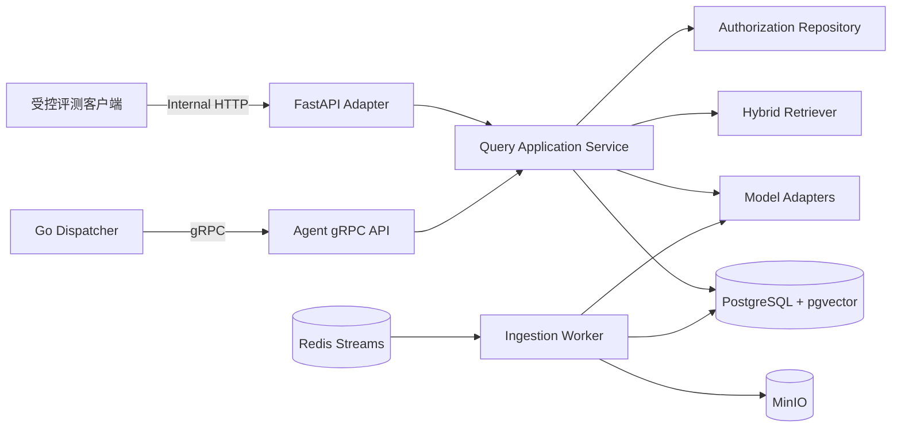

# 企业微信智能知识 Agent 平台——Python Agent 服务接口文档（V1.0）

## 1. 文档信息

| 项目 | 内容 |
| --- | --- |
| 文档版本 | V1.0 |
| 文档状态 | MVP 研发基线草案 |
| 上游文档 | 《系统详细设计（V1.0）》、`Go Gateway API 接口文档（V1.0）` |
| 服务实现 | Python 3.12+、`grpc.aio`、FastAPI |
| 业务契约 | [`proto/agent/v1/agent.proto`](../proto/agent/v1/agent.proto) |

### 1.1 目的

本文定义 Python Agent 的服务边界、gRPC 契约、内部 FastAPI 接口、在线 RAG 状态机、模型适配器和文档索引 Worker。目标是让 Go Gateway、Agent、数据层和测试团队使用同一套可验证语义。

### 1.2 MVP 范围

包含：

- 带实时权限过滤的企业知识问答；
- 对话上下文、查询规范化、混合检索、Rerank、上下文组装；
- 本地 LLM 结构化生成、引用校验和证据不足拒答；
- PDF、DOCX、XLSX、Markdown、TXT 的解析、切片和索引；
- 模型、Prompt、检索配置的版本记录；
- gRPC、内部 FastAPI、Redis Worker 的错误和重试语义；
- 查询和索引流程的日志、指标和链路追踪。

不包含：

- CRM、数据库查询、审批等业务工具调用；
- 多 Agent 自主规划；
- 图片理解、OCR、语音和文件消息直接问答；
- 向最终用户直接开放 Python 服务；
- 文档上传、企业微信协议、SSO 和消息发送；
- 文档物理删除与对象清理由 Gateway 后台任务负责，Agent Worker 只负责索引和重建。

## 2. 服务拓扑与进程角色



### 2.1 进程角色

| 进程角色 | 默认端口/入口 | 职责 |
| --- | --- | --- |
| `agent-grpc` | `50051` | `AnswerQuestion`、`GetHealth` |
| `agent-http` | `8081` | FastAPI 健康检查和受控评测接口 |
| `agent-worker` | Redis Consumer Group | 文档解析、切片、Embedding、索引与重建 |

三个角色复用同一应用层和适配器代码，但独立部署、独立设置并发和资源限制。在线问答与离线索引不得共享无上限的线程池、连接池或 GPU 请求队列。

### 2.2 依赖边界

| 依赖 | 用途 | 失败策略 |
| --- | --- | --- |
| PostgreSQL/pgvector | 身份权限、会话、检索、回答和索引 | 权限与问答失败关闭，不使用扩大权限的缓存 |
| Redis Streams | 索引任务 | 不 ACK，按有限策略重试 |
| MinIO | 读取原始文档 | 索引任务可重试失败 |
| Embedding | 查询与文档向量 | 在线问答默认不可用；索引任务重试 |
| Reranker | 候选重排 | 可配置降级为融合排序并记录降级 |
| LLM | 生成最终回答 | 返回可重试服务错误，不用模型常识或原文拼接替代 |

### 2.3 框架约束

- gRPC 使用 `grpc.aio`；
- FastAPI 只是内部 HTTP Adapter，不复制一套独立业务逻辑；
- Pydantic 用于配置和内部结构校验；
- 可按需复用 LlamaIndex 的解析或索引组件，但领域对象、ACL 和存储接口不能依赖其私有类型；
- MVP 使用显式状态机，不要求 LangGraph；出现多工具、多分支恢复流程后再评估引入。

## 3. 契约与版本管理

### 3.1 单一事实来源

gRPC 的单一事实来源是：

```text
proto/agent/v1/agent.proto
```

- Go 和 Python 代码均从该文件生成；
- 禁止手写或复制生成类型；
- `.proto` 字段编号一经发布不得复用；
- 新增字段只能使用新编号并保持旧字段语义；
- 删除字段时必须使用 `reserved` 保留名称和编号；
- FastAPI DTO 显式映射到应用命令，不作为 gRPC 的第二事实来源。

仓库尚未确定 Go module path，因此 V1.0 proto 暂不写死 `go_package`。进入工程初始化时通过代码生成配置映射包路径，并在 module path 固定后补充兼容的 `go_package`。

### 3.2 主版本规则

| 变更 | `agent.v1` 是否允许 |
| --- | --- |
| 新增可选字段 | 允许 |
| 新增 RPC | 允许 |
| 新增稳定拒答码/错误原因 | 允许，调用方必须安全处理未知值 |
| 修改字段编号或类型 | 禁止 |
| 改变 ACL、幂等或拒答语义 | 禁止 |
| 把普通成功拒答改为 gRPC 错误 | 禁止 |

### 3.3 gRPC Metadata

| Metadata | 必填 | 说明 |
| --- | --- | --- |
| `authorization` 或 mTLS 身份 | 是 | Gateway/Dispatcher 服务身份 |
| `x-request-id` | 是 | 与请求体 `request_id` 一致 |
| `traceparent` | 是 | W3C Trace Context |
| `grpc-timeout` | 是 | 由调用方 Deadline 自动表达 |

请求体 `trace_id` 用于跨异步边界持久化。若它与 `traceparent` 中的 Trace ID 不一致，Agent 返回 `INVALID_ARGUMENT`，避免一次业务请求被拆成两条不可关联链路。

### 3.4 服务认证

- gRPC 和内部 HTTP 均只监听企业内网；
- 生产环境优先使用 mTLS 或工作负载身份；
- 过渡期服务 Token 必须短时、可轮换并从 Secret Manager 注入；
- 服务身份只授予调用 Agent 的权限，不复用平台管理员身份；
- 身份验证在 gRPC Interceptor/FastAPI Middleware 中完成，失败时业务处理器不运行。

## 4. gRPC API

### 4.1 `AnswerQuestion`

```text
agent.v1.AgentService/AnswerQuestion
```

调用方式：Unary Request / Unary Response。

#### 请求字段

| 字段 | 编号 | 必填 | 约束 |
| --- | ---: | --- | --- |
| `request_id` | 1 | 是 | UUID/ULID，8～128 字符，全链路幂等键 |
| `tenant_id` | 2 | 是 | 内部企业 UUID，必须属于服务身份允许范围 |
| `user_id` | 3 | 是 | 内部用户 UUID，不接受企业微信外部 ID |
| `conversation_id` | 4 | 否 | 为空时创建新会话；非空时必须属于当前用户和企业 |
| `question` | 5 | 是 | Trim 后 1～4000 个 Unicode 字符 |
| `trace_id` | 6 | 是 | 32 位小写十六进制 Trace ID |
| `knowledge_base_ids` | 7 | 否 | 去重后最多 50 个；始终与实时授权范围取交集 |
| `channel` | 8 | 是 | `WECOM`、`WEB`、`EVAL`，未知值拒绝 |

请求示例的 JSON 映射：

```json
{
  "requestId": "01JABCDEF0123456789",
  "tenantId": "0198a111-1111-7111-8111-111111111111",
  "userId": "0198a222-2222-7222-8222-222222222222",
  "conversationId": "",
  "question": "客户开户需要哪些资料？",
  "traceId": "4bf92f3577b34da6a3ce929d0e0e4736",
  "knowledgeBaseIds": [],
  "channel": "WECOM"
}
```

Proto JSON 映射使用 `lowerCamelCase`；Python 领域对象仍使用 `snake_case`，转换只发生在 Adapter 层。

#### 响应字段

| 字段 | 编号 | 语义 |
| --- | ---: | --- |
| `message_id` | 1 | 已持久化回答消息 ID |
| `answer` | 2 | 可直接交给 Gateway 渲染的纯文本答案 |
| `citations` | 3 | 已校验且有序的来源列表 |
| `refused` | 4 | 是否因证据或安全策略拒答 |
| `refusal_reason` | 5 | 稳定拒答码；非拒答时为空 |
| `conversation_id` | 6 | 实际使用或新建的会话 ID |
| `created_at` | 7 | 回答持久化时间 |

响应 JSON 映射示例：

```json
{
  "messageId": "0198a333-3333-7333-8333-333333333333",
  "answer": "客户开户通常需要身份材料、开户申请和授权文件，具体清单以客户类型为准。[1]",
  "citations": [
    {
      "index": 1,
      "documentId": "0198a444-4444-7444-8444-444444444444",
      "documentVersion": 3,
      "title": "客户开户管理办法",
      "locatorType": "PAGE",
      "locatorValue": "4",
      "effectiveAt": "2026-05-01T00:00:00Z"
    }
  ],
  "refused": false,
  "refusalReason": "",
  "conversationId": "0198a555-5555-7555-8555-555555555555",
  "createdAt": "2026-08-06T13:30:05Z"
}
```

### 4.2 引用语义

- `index` 从 1 开始，连续、唯一，并与答案中的 `[n]` 一致；
- 每条引用必须对应实际进入最终 Prompt 的授权切片；
- `document_version` 是生成时使用的业务版本号；
- `title` 和定位信息从数据库读取，禁止直接采用模型生成值；
- `locator_type` 支持 `PAGE`、`HEADING`、`PARAGRAPH`、`SHEET_RANGE`、`LINE_RANGE`；
- `effective_at` 不存在时保持字段未设置，不伪造时间；
- 一个引用可支持多个相邻结论，但每个关键企业事实至少有一个引用；
- Agent 不向 Gateway 返回内部 Chunk ID、向量分数或未授权候选。

### 4.3 稳定拒答码

证据不足和内容安全拒答是正常业务结果，gRPC 状态仍为 `OK`。

| `refusal_reason` | 场景 | 用户展示原则 |
| --- | --- | --- |
| `NO_RELEVANT_EVIDENCE` | 无授权证据或证据低于阈值 | 统一说明知识库依据不足，不泄露是否存在受限文档 |
| `CONFLICTING_EVIDENCE` | 当前有效证据相互冲突 | 提示联系知识负责人确认 |
| `HIGH_RISK_INSUFFICIENT_EVIDENCE` | 高风险问题只有不完整依据 | 不给出确定性建议 |
| `INPUT_POLICY_BLOCKED` | 输入触发安全或敏感策略 | 返回受控安全提示 |

用户请求明确提及无权资源时，对外仍使用 `NO_RELEVANT_EVIDENCE`。真实内部原因只写安全审计，不通过答案或引用暴露知识库是否存在。

依赖故障、程序错误、超时和容量不足不是拒答，必须使用 gRPC 错误让调用方决定重试或发送服务异常提示。

### 4.4 幂等与并发调用

唯一约束：

```text
tenant_id + request_id
```

请求指纹：

```text
sha256(tenant_id + user_id + conversation_id + normalized_question +
       sorted(knowledge_base_ids) + channel)
```

这里的 `normalized_question` 仅指确定性的 Unicode NFC、首尾空白和连续空白规范化，不是 LLM 生成的查询改写结果，避免模型或 Prompt 版本变化造成幂等指纹漂移。

处理规则：

1. 首次请求：创建 `query_run`，状态为 `RECEIVED`；
2. 相同 `request_id`、相同指纹且已完成：直接返回已持久化响应，不再次调用模型；
3. 相同 ID、不同指纹：返回 `FAILED_PRECONDITION / REQUEST_ID_CONFLICT`；
4. 相同 ID、相同指纹仍在执行：短暂等待可配置窗口，仍未完成则返回 `ABORTED / REQUEST_IN_PROGRESS` 和 `RetryInfo`；
5. 前次处于可重试失败：使用原运行记录开始新 attempt，不创建第二条回答；
6. 回答、引用、Token 用量和运行完成状态在同一事务提交。

如果服务已提交回答但响应在网络中丢失，调用方重试会得到同一个 `message_id`。

### 4.5 Deadline 与取消

- Gateway 默认设置 15 秒 Deadline，性能目标仍为正常负载下 P95 约 4.5 秒以内；
- Agent 在每个阶段计算剩余时间，不启动明显无法在 Deadline 内完成的新模型调用；
- 调用取消后尽快中断未开始的检索或推理，并把运行标记为可重试取消；
- 如果回答事务已经提交，取消不能回滚已完成结果；
- 不把客户端断开直接传递为数据库事务取消，必须先保证幂等状态一致；
- LLM、Embedding、Reranker 子调用的超时必须小于剩余总 Deadline。

### 4.6 `GetHealth`

```text
agent.v1.AgentService/GetHealth
```

该 RPC 返回浅层状态：

| `status` | 含义 |
| --- | --- |
| `UP` | 进程可接受请求 |
| `DEGRADED` | 可选依赖降级，例如 Reranker 回退 |
| `DOWN` | 关键依赖或配置不满足接流条件 |

`version` 返回应用构建版本，不包含内部主机名、模型地址和 Secret。Kubernetes 仍应优先使用进程各自的 readiness 探针，不用高频深度 gRPC 检查压测所有依赖。

### 4.7 gRPC 错误详情

使用标准 gRPC Status，并在可用时附加 `google.rpc.ErrorInfo`：

```text
domain = "agent.internal"
reason = 稳定错误原因
metadata["request_id"] = 请求 ID
```

可重试错误附加 `google.rpc.RetryInfo`。禁止在 `message` 或 metadata 中放入问题正文、SQL、Prompt、对象键或模型原始响应。

| gRPC Status | 稳定原因示例 | 是否重试 |
| --- | --- | --- |
| `INVALID_ARGUMENT` | `REQUEST_INVALID`、`TRACE_ID_MISMATCH` | 否 |
| `UNAUTHENTICATED` | `SERVICE_IDENTITY_INVALID` | 否，立即告警 |
| `PERMISSION_DENIED` | `USER_DISABLED`、`CONVERSATION_ACCESS_DENIED` | 否 |
| `NOT_FOUND` | `TENANT_NOT_FOUND`、`USER_NOT_FOUND`、`CONVERSATION_NOT_FOUND` | 否 |
| `FAILED_PRECONDITION` | `REQUEST_ID_CONFLICT`、`INDEX_CONFIGURATION_INVALID` | 否 |
| `ABORTED` | `REQUEST_IN_PROGRESS`、`TRANSACTION_CONFLICT` | 按 `RetryInfo` |
| `RESOURCE_EXHAUSTED` | `QUERY_CAPACITY_EXHAUSTED` | 按 `RetryInfo` |
| `DEADLINE_EXCEEDED` | `MODEL_TIMEOUT`、`QUERY_DEADLINE_EXCEEDED` | 最多 1 次 |
| `UNAVAILABLE` | `DATABASE_UNAVAILABLE`、`MODEL_UNAVAILABLE` | 最多 1 次 |
| `INTERNAL` | `UNEXPECTED_INTERNAL_ERROR` | 默认不重试，告警 |

## 5. 内部 FastAPI

### 5.1 使用边界

FastAPI 仅用于运维和受控评测：

- 只监听内网或 Pod 本地管理端口；
- 使用 mTLS、工作负载身份或独立服务 Token；
- 生产环境默认关闭评测查询端点；
- 不为普通用户提供浏览器直连；
- 不允许通过 HTTP 传入角色、ACL、Prompt、检索上下文或模型参数。

健康检查可以在独立管理监听器上免认证，但必须由 Kubernetes NetworkPolicy 或等价网络边界保护；评测接口始终要求服务身份。

### 5.2 `GET /internal/v1/health/live`

只检查进程和事件循环：

```json
{
  "status": "UP",
  "version": "1.0.0"
}
```

### 5.3 `GET /internal/v1/health/ready`

响应示例：

```json
{
  "status": "DEGRADED",
  "components": {
    "database": "UP",
    "embedding": "UP",
    "reranker": "DEGRADED",
    "llm": "UP"
  }
}
```

- 依赖状态来自短期缓存的后台探测，不在每次 readiness 调用中执行完整推理；
- 数据库、Embedding 或 LLM 为 `DOWN` 时 `agent-grpc` 不 Ready；
- Reranker 在允许融合排序回退时可标记 `DEGRADED`；
- `agent-worker` 的 readiness 另检查 Redis、MinIO、数据库和 Embedding。

### 5.4 `POST /internal/v1/admin/rag/evaluate`

使用 `X-Internal-Token` 保护的批量 RAG 评测接口。每批最多 20 题，按顺序调用真实 Query Service，避免本地模型被评测并发压垮。请求：

```json
{
  "user_id": null,
  "knowledge_base_ids": ["0198a111-1111-7111-8111-111111111111"],
  "cases": [
    {
      "question": "客户开户需要哪些资料？",
      "expected_keywords": ["营业执照", "法人身份证"],
      "expected_sources": ["客户开户指引"],
      "expect_refusal": false
    }
  ]
}
```

响应包含批次 ID、实际评测用户、整体指标和逐题结果。整体指标包括通过率、引用率、关键词召回、来源命中、拒答准确率、平均延迟、P50、P95、吞吐量和错误数。逐题结果包含回答、引用、命中明细、耗时与错误码。

评测请求仍执行真实 ACL。`user_id` 为空时使用专用普通评测用户，只能访问 `ALL_EMPLOYEES` 授权的知识；指定用户时按该用户的实时部门、角色和个人权限执行，不提供 `skip_acl` 或管理员绕过。问题、回答和引用按 `EVAL` 渠道持久化，批次汇总当前由管理后台展示和导出 JSON。

### 5.5 `GET /metrics`

返回 Prometheus 指标，只允许监控网络访问。指标标签不得包含问题、文档标题、用户 ID、请求 ID、会话 ID 或 Chunk ID。

### 5.6 FastAPI 错误

评测接口使用与 Gateway 相同的安全错误信封：

```json
{
  "error": {
    "code": "AGENT_UNAVAILABLE",
    "message": "问答服务暂时不可用"
  },
  "request_id": "01JABCDEF0123456789"
}
```

`INVALID_ARGUMENT` 映射 400，服务身份失败映射 401，业务权限失败映射 403，幂等冲突/运行中映射 409，容量不足映射 429，依赖不可用映射 503，Deadline 映射 504。不得返回 Python 异常、模型响应或堆栈。

## 6. 在线问答状态机

### 6.1 状态定义

```text
RECEIVED
  → VALIDATED
  → AUTHORIZED
  → CONTEXTUALIZED
  → QUERY_NORMALIZED
  → RETRIEVED
  → RERANKED
  → GROUNDED
  → GENERATED
  → OUTPUT_VALIDATED
  → PERSISTED
  → COMPLETED

证据不足 → COMPLETED_WITH_REFUSAL
临时错误 → RETRYABLE_FAILED
永久错误 → FINAL_FAILED
调用取消 → CANCELLED_RETRYABLE（未提交回答时）
```

每个阶段记录开始时间、结束时间、状态和安全的诊断码。不得持久化隐藏思维链；只保存可解释的阶段结果，例如候选数量、配置版本和拒答原因。

### 6.2 `VALIDATED`

- 校验请求字段、长度、UUID、渠道和 Trace；
- Unicode 规范化使用 NFC，保留有业务意义的编号、大小写和标点；
- 去除首尾和异常连续空白，不进行可能改变业务含义的自动纠错；
- 输入安全规则在检索前执行，高风险命中直接安全拒答；
- 计算不可逆请求指纹用于幂等检查。

### 6.3 `AUTHORIZED`

Agent 必须从数据库加载：

- 企业、用户及用户状态；
- 用户直接角色；
- 用户所属部门及启用的子部门继承关系；
- 可访问知识库和文档限制 ACL；
- 知识库、文档、文档版本和索引状态。

客户端传入的 `knowledge_base_ids` 只用于缩小范围：

```text
effective_scope = current_authorized_scope ∩ requested_scope
```

未传入时使用全部当前授权范围。交集为空时返回普通拒答 `NO_RELEVANT_EVIDENCE`，不得暗示其他知识库是否存在。

### 6.4 `CONTEXTUALIZED`

- 新会话在当前企业和用户下创建；
- 现有会话必须属于相同企业、用户和允许渠道；
- 默认最多读取最近 6 轮、最多 1500 tokens 的历史，参数可配置；
- 历史只用于补全“它、这个流程、上一条”等指代；
- 历史 AI 回答不是企业事实来源，不能绕过当前文档检索；
- 当前权限已变化时，不把已失权文档对应的旧回答放入上下文；
- 对话过长按轮次和 Token 双重预算截断，不做无审计的永久摘要。

### 6.5 `QUERY_NORMALIZED`

产生：

```json
{
  "original_query": "怎么开户？",
  "normalized_query": "客户开户流程和所需资料",
  "retrieval_variants": [
    "客户开户条件",
    "客户开户申请材料"
  ]
}
```

规则：

- 原始问题始终参与检索；
- 只有问题明显口语化、含指代或企业简称时才生成变体；
- 变体最多 3 个，不能引入原问题没有的客户、部门、产品或权限范围；
- 查询改写失败时使用原问题继续，不把它视为整个问答失败；
- 生成的变体不写普通日志，只记录数量、耗时和 Prompt 版本。

### 6.6 `RETRIEVED`

#### 权限过滤条件

向量和关键词查询必须在候选文本返回应用层之前包含相同过滤：

```text
chunk.tenant_id = request.tenant_id
knowledge_base.status = ACTIVE
document.status = READY
document_version.is_current = true
chunk.index_version = active_index_version
effective_at <= now（为空时不限制）
expires_at > now（为空时不限制）
用户匹配至少一个 knowledge_base ACL
文档为 INHERIT，或用户同时匹配至少一个 document RESTRICT ACL
```

部门子树匹配使用数据库闭包表或物化路径，不能在应用内先召回后过滤。任何无权限正文不得进入 Python 候选对象、Reranker、Prompt、缓存或诊断日志。

#### 向量检索

- 使用当前 `embedding_model` 对规范化查询和允许的变体编码；
- 模型输出维度、归一化策略与索引元数据严格一致；
- 默认每个查询通道取 `top_k_vector=30`；
- pgvector 距离类型由索引配置固定，不能在请求级切换；
- 只返回最小必要字段和安全元数据。

#### 关键词检索

- 文档和查询使用同一中文 tokenizer 及词典版本；
- 初始实现可采用受控的 Jieba 预分词配合 PostgreSQL `simple` 配置，最终以企业语料评测为准；
- 默认取 `top_k_keyword=30`；
- 编号、产品型号、合同代码和专有词不得在清洗阶段丢失；
- tokenizer 或词典版本变化必须触发索引重建。

#### 融合

使用加权 Reciprocal Rank Fusion：

```text
rrf_score(d) = Σ channel_weight / (rrf_k + rank_channel(d))
```

初始 `rrf_k=60`，原查询权重高于扩展查询。按 `chunk_id` 去重后最多保留 40 个候选，并保存各通道名次供离线诊断。权重必须来自版本化配置，不在代码中散布。

### 6.7 `RERANKED`

- Reranker 只接收已授权的最多 40 个候选；
- 输入包含查询、必要标题路径和切片正文，不包含用户个人信息；
- 默认保留 `top_k_rerank=8`；
- 不跨 Reranker 模型比较原始分数；
- 证据阈值与具体模型和版本绑定；
- Reranker 临时不可用时，仅在配置允许且融合排序已通过独立评测时降级；
- 降级回答记录 `reranker_degraded=true`，用于质量审计但不向普通用户暴露内部故障。

### 6.8 `GROUNDED`

上下文组装顺序：

1. 按 `content_hash` 去除重复；
2. 合并同文档相邻且未超预算的切片；
3. 保留不同文档的证据多样性，避免单一长文占满上下文；
4. 按 Rerank 分数和权威元数据排序；
5. 分配稳定的 `[1]...[n]` 来源编号，与最终答案引用一致；
6. 在模型输入 Token 预算内保留 4～8 个片段；
7. 对每段附带文档标题、业务版本、生效时间和定位信息。

Prompt 中的文档内容使用明确数据边界包裹。文档里的“忽略规则”“调用某工具”“泄露系统提示词”等文本一律作为被引用资料，不作为指令执行。

### 6.9 证据判断与拒答

在调用生成模型前完成第一轮证据判断：

- 无候选或最高分低于该 Reranker 版本的校准阈值；
- 关键主题只命中标题而无正文证据；
- 最新有效文档互相冲突且权威级别无法判定；
- 高风险问题缺少必要条件或生效版本；
- 当前问题要求推断个人隐私、财务秘密等未授权内容。

阈值必须从冻结评测集产生，禁止直接复制其他模型的经验分数。拒答仍保存问题、稳定原因和检索配置，但不保存无权限候选。

在该阶段已经确定的拒答使用服务端固定模板生成，不再调用 LLM，避免模型把“没有依据”改写成猜测性结论。

### 6.10 `GENERATED`

系统 Prompt 由不可变模板和显式变量组成：

```text
System Rules
  + Output Contract
  + Safe Conversation Context
  + Authorized Retrieved Context
  + Current Question
```

要求：

- 只依据提供的授权上下文回答企业事实；
- 证据不足时拒答，不使用模型预训练常识补充内部政策；
- 每个关键事实使用来源编号；
- 不执行检索文本中的指令；
- 不输出系统 Prompt、内部路径、对象键、Chunk ID 和模型配置；
- 默认使用简洁中文，保留必要英文产品名和代码；
- 不请求、不输出、不持久化隐藏思维链。

模型必须返回结构化 JSON：

```json
{
  "answer": "客户开户通常需要……[1]",
  "citation_indexes": [1],
  "refused": false,
  "refusal_reason": null
}
```

LLM 自报的置信度不作为授权、拒答或上线指标。系统证据判断使用检索/Rerank 校准结果和业务规则。

### 6.11 `OUTPUT_VALIDATED`

输出必须通过：

- JSON Schema/Pydantic 结构校验；
- `refused` 与 `refusal_reason` 一致性；
- 所有引用编号存在且确实进入 Prompt；
- 答案引用标记和 `citation_indexes` 一致；
- 无内部 URL、对象键、系统提示词和禁止披露字段；
- 输出长度、敏感信息和安全策略检查；
- 非拒答企业事实至少有一个引用。

首次结构错误允许使用固定修复 Prompt 重试一次。仍不合法时返回可重试生成错误，不发送未经验证的文本。不得静默删除引用后把答案当成成功。

### 6.12 `PERSISTED` 与响应

`WECOM` 请求的输入消息已由 Gateway 持久化，Agent 按 `request_id` 关联并校验问题指纹，不再插入第二条用户消息。`WEB/EVAL` 请求由应用层幂等创建输入消息。

同一数据库事务写入：

- 回答消息及其最终文本；
- 引用和生成时的文档版本/定位快照；
- 模型、Prompt、检索、Embedding、Reranker 配置版本；
- 输入/输出 Token、各阶段耗时和降级标记；
- `query_run` 完成状态和请求指纹。

事务提交后才返回 `AnswerQuestionResponse`。如果持久化失败，不返回仅存在于内存中的答案。

## 7. 模型适配器契约

### 7.1 通用原则

- 业务层依赖 Python Protocol/抽象接口，不依赖 Ollama、vLLM 或特定 SDK 类型；
- 所有模型流量留在企业网络；
- 端点、模型名、超时和并发从配置注入；
- 适配器将供应商错误映射为统一异常；
- 输入输出正文不写普通日志；
- 模型响应必须记录模型名、服务版本和耗时。

### 7.2 LLM Adapter

逻辑接口：

```python
class LLMClient(Protocol):
    async def generate(self, request: LLMRequest) -> LLMResult: ...
```

`LLMRequest` 至少包含：Prompt 消息、Prompt 版本、最大输出 Token、温度、截止时间和结构化输出 Schema。调用方不传任意模型 URL。

MVP 默认模型配置为 `Qwen3.5-4B`，通过 Ollama 或 vLLM 的 OpenAI-compatible 接口接入。初始生成参数建议使用低温度确定性配置，最终值通过评测固定。

重试规则：

- 连接失败、明确限流和临时 5xx 最多重试 1 次；
- Deadline 不足时不重试；
- 结构输出错误由应用层固定修复流程处理，不由网络适配器盲重试；
- 不在不同模型间自动切换后仍声称使用同一模型版本。

### 7.3 Embedding Adapter

逻辑接口：

```python
class EmbeddingClient(Protocol):
    async def embed_query(self, texts: Sequence[str]) -> EmbeddingBatch: ...
    async def embed_documents(self, texts: Sequence[str]) -> EmbeddingBatch: ...
```

要求：

- 默认模型 `bge-m3`；
- Query 和 Document 使用模型要求的正确指令/前缀；
- 返回向量数量必须与输入一致，维度必须匹配索引配置；
- 检查 NaN、Infinity 和零向量；
- 批大小由 Token 和模型服务限制共同决定；
- 模型版本、维度、归一化和前缀策略构成索引版本的一部分；
- 在线查询不允许使用与当前索引不同的 Embedding 版本。

### 7.4 Reranker Adapter

```python
class RerankerClient(Protocol):
    async def rank(self, query: str, passages: Sequence[Passage]) -> RankResult: ...
```

默认模型 `bge-reranker-v2-m3`。响应必须覆盖每个候选的输入索引和分数，出现缺失、重复或非法分数时视为协议错误。阈值与模型版本绑定，不把不同版本的分数直接比较。

### 7.5 Tokenizer

- LLM Token 预算使用与目标 LLM 匹配的 tokenizer；
- Embedding 批处理预算使用 Embedding 模型 tokenizer；
- 不能用字符数代替模型 Token 作为唯一限额；
- tokenizer 版本写入运行和索引元数据；
- tokenizer 不可用时启动失败，不在运行时猜测预算。

## 8. Prompt 管理

### 8.1 模板版本

建议路径：

```text
agent/prompts/query_rewrite/v1.yaml
agent/prompts/answer_grounded/v1.yaml
agent/prompts/output_repair/v1.yaml
```

每个模板包含：稳定 ID、语义版本、模板正文、变量 Schema、允许模型、变更说明和内容 SHA-256。运行时只加载部署允许列表中的版本。

### 8.2 变量允许列表

| 变量 | 来源 |
| --- | --- |
| `question` | 已验证当前问题 |
| `conversation_context` | 经过权限和长度过滤的历史 |
| `retrieved_context` | 已授权且编号的切片 |
| `output_schema` | 应用内固定 Schema |
| `locale` | 服务端允许值 |

用户不能提供 `system_rules`、工具列表、模型参数或模板路径。

### 8.3 发布流程

- Prompt 变更必须经过代码评审和冻结评测集回归；
- 新版本与旧版本并存，不能就地修改已发布内容；
- 回答记录保存 Prompt ID、版本和哈希；
- 回滚通过配置切回旧版本，不修改历史回答；
- Prompt A/B 测试必须按受控实验 ID 分流，不能按用户敏感属性任意分组。

## 9. 文档索引 Worker

### 9.1 输入事件

消费：

```text
wxagent:v1:document:index:requested
```

支持 `DOCUMENT_INDEX` 和 `DOCUMENT_REINDEX` 任务。事件只携带 ID：

```json
{
  "event_type": "document.index.requested",
  "schema_version": "1.0",
  "event_id": "01JABCDEF0123456789",
  "occurred_at": "2026-08-06T13:30:00Z",
  "tenant_id": "0198a111-1111-7111-8111-111111111111",
  "request_id": "01JREQUEST0123456789",
  "trace_id": "4bf92f3577b34da6a3ce929d0e0e4736",
  "attempt": 0,
  "data": {
    "job_id": "0198a666-6666-7666-8666-666666666666",
    "document_id": "0198a777-7777-7777-8777-777777777777",
    "document_version_id": "0198a888-8888-7888-8888-888888888888",
    "index_config_version": "rag-default-v1"
  }
}
```

Worker 根据 ID 从数据库读取对象键、哈希、格式、ACL 和索引配置。事件中的同名扩展字段不能覆盖数据库值。

### 9.2 任务认领与幂等

- `job_id` 是任务幂等键；
- 使用数据库条件更新认领 `QUEUED/RETRYING` 任务并写入租约；
- 租约包含 `worker_id`、`leased_until` 和 heartbeat；
- 消费者崩溃后，其他 Worker 只能在租约过期后接管；
- 已 `SUCCEEDED` 的重复事件直接 ACK；
- `FAILED` 是否重试由错误分类和最大 attempt 决定；
- 相同 `document_version_id + index_config_version` 具有唯一活动索引约束；
- 重复执行不得产生重复 Chunk 或覆盖当前有效索引。

### 9.3 状态机

```text
QUEUED
  → VALIDATING
  → DOWNLOADING
  → PARSING
  → CHUNKING
  → EMBEDDING
  → INDEXING
  → SWITCHING
  → SUCCEEDED

临时错误 → RETRYING
永久错误 → FAILED
租约丢失 → ABANDONED（当前 Worker 立即停止提交）
```

对外文档状态映射仍使用系统设计中的 `UPLOADED/PARSING/CHUNKING/EMBEDDING/INDEXING/READY/FAILED`。内部更细状态不得破坏管理 API 的稳定枚举。

### 9.4 `VALIDATING` 与下载

- 校验企业、任务、文档、版本和对象属于同一作用域；
- 校验任务状态、索引配置存在且已发布；
- 使用数据库保存的对象引用读取 MinIO；
- 重新核对对象大小和 SHA-256，防止上传后被替换；
- 使用流式读取和受控临时目录，不把大文件整体载入内存；
- 临时目录按任务隔离，成功、失败和进程恢复时均可清理；
- 加密 PDF、扫描 PDF 和损坏 OOXML 返回稳定不可重试错误；
- 对 OOXML 限制压缩展开大小、文件数量和压缩比，防止 ZIP Bomb；
- 禁止解析外部实体、外部链接、宏和公式执行结果。

### 9.5 统一解析产物

```json
{
  "document_version_id": "0198a888-8888-7888-8888-888888888888",
  "parser_id": "pdf_text",
  "parser_version": "1.0.0",
  "sections": [
    {
      "ordinal": 1,
      "heading_path": ["报销制度", "审批流程"],
      "content": "员工提交申请后，由部门负责人审批。",
      "locator": {
        "type": "PAGE",
        "value": "3"
      },
      "metadata": {}
    }
  ]
}
```

格式规则：

| 格式 | 处理 | 定位 |
| --- | --- | --- |
| PDF | 提取文本层，识别并移除重复页眉页脚 | `PAGE` |
| DOCX | 保留标题路径、段落和表格 | `HEADING`/`PARAGRAPH` |
| XLSX | 表头与连续数据行组成语义块，不计算公式 | `SHEET_RANGE` |
| Markdown | 按标题树解析，代码块保持完整 | `HEADING`/`LINE_RANGE` |
| TXT | 按段落和行号读取 | `LINE_RANGE` |

### 9.6 清洗与切片

- Unicode NFC 规范化，移除控制字符和异常空白；
- 保留编号、型号、日期、金额、表头和否定词；
- 先按语义边界切分，再按 Token 上限二次切分；
- 初始目标 400～700 tokens，重叠 50～100 tokens；
- 表格切片重复必要表头；
- 标题路径作为切片元数据，不重复堆叠到正文造成检索偏置；
- 使用内容哈希识别同版本重复片段；
- Chunk ID 由 `document_version_id + index_config_version + ordinal + content_hash` 确定性生成。

切片结构至少包含：

```json
{
  "chunk_id": "0198a999-9999-7999-8999-999999999999",
  "document_version_id": "0198a888-8888-7888-8888-888888888888",
  "ordinal": 1,
  "content": "员工提交申请后，由部门负责人审批。",
  "content_hash": "sha256-placeholder",
  "heading_path": ["报销制度", "审批流程"],
  "locator_type": "PAGE",
  "locator_value": "3",
  "token_count": 22
}
```

### 9.7 Embedding 与关键词索引

- 批量调用 Embedding，批大小受最大 Token 和模型服务限制；
- 每批结果在写入前校验数量、维度和有限数值；
- 关键词 tokenizer 与查询侧使用相同词典版本；
- 新索引先写入 staging index version，不立即参与查询；
- 每批 upsert 使用稳定 Chunk ID，可安全重试；
- 任务进度按批次节流更新，不对每个 Chunk 单独提交事务；
- 写入完成后核对预期 Chunk 数、实际 Chunk 数和向量数一致。

索引版本：

```text
sha256(parser_id + parser_version + chunk_config + lexical_tokenizer_version +
       embedding_model + embedding_dimension + normalization_strategy)
```

### 9.8 原子切换

新文档版本：

1. staging Chunk 和向量完整写入；
2. 校验所有索引统计；
3. `effective_at` 已生效时，在单个数据库事务中停用旧当前版本、启用新版本及其索引；
4. `effective_at` 在未来时，新版本保持已索引但非当前状态，并创建定时激活记录，旧版本继续服务；
5. 激活任务到期后重新校验文档状态、ACL 和版本顺序，再原子切换；
6. 更新任务为 `SUCCEEDED`；索引成功与业务版本生效是两个独立事实；
7. 事务提交后异步清理过期 staging/旧索引。

同一文档版本重建索引：

1. 文档业务版本保持不变；
2. 新 `index_version` 完整写入 staging；
3. 事务切换 `active_index_version`；
4. 旧索引在保留窗口后清理。

任何失败都不能让半成品索引参与查询。新版本失败时，旧当前版本继续服务。

### 9.9 错误分类

| 错误 | 分类 | 示例处理 |
| --- | --- | --- |
| 对象存储短时不可用 | 可重试 | 退避重试 |
| Embedding 超时/5xx | 可重试 | 从稳定批次边界继续 |
| 数据库事务冲突 | 可重试 | 短退避后重试切换 |
| 文件损坏/加密 PDF | 永久 | `FAILED`，返回安全原因 |
| 不支持格式 | 永久 | `FAILED` |
| SHA-256 不一致 | 安全/永久 | 停止、告警、禁止索引 |
| 索引配置不存在 | 永久配置错误 | 停止并告警 |

Worker 将安全错误摘要写入 Job，不写原始文档正文或解析异常中的内容片段。超过最大 attempt 后事件进入 Gateway 定义的死信流。

## 10. 数据访问契约

### 10.1 读取实体

在线问答读取：

- `tenants`、`users`、`departments`、部门层级；
- `roles`、`user_roles`、知识库管理范围；
- `knowledge_bases`、`acl_entries`、`documents`、`document_versions`；
- `chunks`、活动索引元数据；
- `conversations`、`messages` 和仍有权限的历史引用。

索引 Worker 读取：

- `jobs`、`documents`、`document_versions`；
- 对象引用、解析/索引配置和当前活动索引。

### 10.2 写入实体

在线问答写入：

- `query_runs` 或等价幂等运行记录；
- 新会话和问题/回答消息关联；
- `citations`；
- Token、模型和阶段指标元数据；
- 安全审计事件。

索引 Worker 写入：

- 文档和任务阶段状态；
- 标准化解析产物引用；
- `chunks`、全文检索字段和向量；
- 活动索引/当前版本切换记录。

### 10.3 租户隔离

- 每个 Repository 方法显式接收 `tenant_id`；
- SQL 必须同时限定租户和资源 ID，禁止只按全局 UUID 查询后再判断；
- 数据库连接设置只用于审计上下文，不能替代 SQL 条件；
- 可使用 PostgreSQL RLS 作为纵深防御，但应用层仍保留租户条件；
- 缓存键必须包含 `tenant_id` 和授权/配置版本；
- 跨租户结果为阻断上线的安全缺陷。

### 10.4 事务边界

- 幂等运行认领：单事务；
- 会话创建和输入消息关联：单事务；
- 回答、引用和运行完成：单事务；
- 索引 staging 批写：分批事务；
- 活动索引和当前文档版本切换：单事务；
- 审计写入尽量与关键业务变更同事务或使用事务 Outbox。

## 11. 缓存

允许缓存：

- 模型 tokenizer 和静态配置；
- 短时知识库检索配置；
- 以 `tenant + user + permission_version` 为键的授权主体集合。

禁止缓存：

- 不带租户和权限版本的授权结果；
- 未过滤候选正文的跨用户结果；
- 包含无权限片段的 Prompt；
- LLM 最终回答作为通用问题缓存；
- MVP 中禁止跨请求复用 Query Embedding；问题可能含敏感信息，后续若启用必须采用短 TTL、加密存储和不可逆缓存键；
- Secret 和服务 Token。

权限变更必须递增 `permission_version` 或显式失效相关键。缓存不可用时回源数据库，不能回退到更宽权限。

## 12. 安全设计

### 12.1 Prompt Injection

- 检索文本始终标记为不可信数据；
- System Rules 与文档上下文使用不同消息/边界；
- 文档中出现工具调用、系统指令或 Base64 指令不执行；
- MVP 不向模型暴露工具；
- 查询改写模型不能改变知识库范围；
- 输出必须经过引用和敏感规则校验；
- 注入检测命中记录规则 ID、文档 ID 和安全哈希，不记录完整恶意正文。

### 12.2 文档解析安全

- 解析器禁用网络、外部实体、宏和脚本；
- 在受限用户、受限临时目录和资源配额下执行高风险解析；
- 配置 CPU、内存、文件数、展开大小和阶段超时；
- 解析器崩溃只影响当前任务，不导致 Worker 主进程反复崩溃；
- 临时文件使用随机目录且权限最小化；
- 不把文件名直接拼入路径或命令。

### 12.3 数据最小化

- 模型只接收回答当前问题所需的授权片段；
- Prompt 不包含姓名、手机号、邮箱等无关个人信息；
- 普通日志不记录问题、答案、正文和模型原始返回；
- 受控排障采样必须脱敏、审批并自动过期；
- Agent 不访问企业微信 Secret 和用户登录 Token。

### 12.4 服务与数据库权限

- `agent-grpc` 数据库角色只拥有问答所需读写；
- `agent-worker` 使用独立角色写索引和任务状态；
- FastAPI 评测身份与生产 Dispatcher 身份分离；
- 模型端点只允许来自 Agent 网络身份；
- Agent 不具有下载任意 MinIO 对象的权限，Worker 凭证限定文档 Bucket/前缀。

## 13. 错误、重试与降级

### 13.1 在线问答

| 阶段 | 临时失败 | 永久失败/正常结果 |
| --- | --- | --- |
| 身份/权限 | 数据库不可用 → `UNAVAILABLE` | 用户禁用 → `PERMISSION_DENIED` |
| 查询改写 | 使用原问题继续 | 输入非法 → `INVALID_ARGUMENT` |
| Embedding | `UNAVAILABLE` | 配置不匹配 → `FAILED_PRECONDITION` |
| 检索 | 数据库临时错误 → `UNAVAILABLE` | 无证据 → 正常拒答 |
| Reranker | 允许时融合排序降级 | 协议错误且不可降级 → `UNAVAILABLE` |
| LLM | 临时错误最多重试 1 次 | 输出持续非法 → `INTERNAL/UNAVAILABLE` |
| 持久化 | 事务错误可短重试 | 唯一约束指纹冲突 → `FAILED_PRECONDITION` |

### 13.2 熔断

- LLM、Embedding、Reranker 分别维护熔断器；
- 熔断器只基于低基数错误分类，不基于单个用户内容；
- 半开探测使用受控小请求；
- 熔断时快速返回 `UNAVAILABLE/RESOURCE_EXHAUSTED`，避免耗尽协程；
- 权限数据库不可用时失败关闭，不使用过期权限扩大访问。

### 13.3 降级标记

允许的降级必须持久化：

```json
{
  "query_rewrite_degraded": false,
  "reranker_degraded": true,
  "model_fallback": false
}
```

MVP 默认不做 LLM 或 Embedding 模型自动切换。未来启用模型 fallback 时，必须记录实际模型并单独通过质量和安全评测。

## 14. 配置

### 14.1 在线问答初始配置

| 配置键 | 初始值/约束 | 说明 |
| --- | --- | --- |
| `query.max_chars` | 4000 | 问题长度上限 |
| `conversation.max_turns` | 6 | 历史轮数 |
| `conversation.max_tokens` | 1500 | 历史 Token 预算 |
| `rewrite.max_variants` | 3 | 不含原问题 |
| `retrieval.top_k_vector` | 30 | 向量候选 |
| `retrieval.top_k_keyword` | 30 | 关键词候选 |
| `retrieval.rrf_k` | 60 | RRF 常数 |
| `retrieval.max_fused` | 40 | 融合后候选上限 |
| `reranker.top_k` | 8 | 重排保留数 |
| `context.min_chunks` | 4 | 有足够证据时的目标下限，不为凑数加入低质片段 |
| `context.max_chunks` | 8 | 上下文片段上限 |
| `llm.max_output_tokens` | 300 | MVP 短回答目标 |
| `query.deadline` | 15 秒 | 硬上限，不能替代 P95 目标 |

证据阈值、Prompt 版本、模型温度和上下文最大 Token 必须由目标模型与评测集共同确定，不给出跨模型通用默认值。

### 14.2 模型配置

| 配置 | 示例 |
| --- | --- |
| `llm.provider` | `vllm` / `ollama` |
| `llm.model` | `Qwen3.5-4B` |
| `llm.endpoint` | Secret/受限配置引用 |
| `embedding.model` | `bge-m3` |
| `embedding.dimension` | 与实际模型和数据库列一致 |
| `reranker.model` | `bge-reranker-v2-m3` |
| `prompt.answer_version` | `answer-grounded-v1` |

### 14.3 Worker 配置

| 配置 | 说明 |
| --- | --- |
| `worker.consumer_group` | 环境隔离的消费组 |
| `worker.concurrency` | 由 CPU、内存、数据库和 Embedding 吞吐确定 |
| `worker.lease_duration` | 必须大于 heartbeat 间隔 |
| `worker.max_attempts` | 默认 3，可按错误类型覆盖 |
| `parser.max_expanded_bytes` | OOXML 展开上限 |
| `chunk.target_tokens` | 400～700 |
| `chunk.overlap_tokens` | 50～100 |
| `embedding.batch_tokens` | 按模型服务限制 |

### 14.4 启动校验

启动时验证：

- 配置 Schema 和必填 Secret 引用；
- Prompt 文件、哈希和变量 Schema；
- 模型名、Embedding 维度与活动索引一致；
- tokenizer 可加载；
- 数据库迁移版本兼容；
- gRPC/FastAPI 监听地址不意外暴露公网；
- 生产环境评测端点默认关闭。

关键配置不一致时 readiness 为 `DOWN`，不能带病接流量。

## 15. 性能与并发

### 15.1 在线问答预算

| 阶段 | P95 预算 |
| --- | ---: |
| 校验、权限、会话、查询改写与混合检索 | 600 ms |
| Reranker | 500 ms |
| 上下文和 Prompt | 200 ms |
| LLM 生成与输出校验 | 3,200 ms |

Agent 目标合计约 4.5 秒，为 Gateway 入队、持久化和发送保留余量。该预算依赖模型预热、300 输出 tokens 以内和目标硬件实测。

### 15.2 并发控制

- gRPC 请求先通过全局和企业级 Semaphore；
- 模型适配器有独立并发上限，不无限创建协程排队；
- 排队时间计入 Deadline，超过容量快速返回 `RESOURCE_EXHAUSTED`；
- 查询和索引 Embedding 使用不同优先级/队列；
- 在线 Query Embedding 优先于离线批量索引；
- PostgreSQL 连接池为 API 与 Worker 分开配置；
- Worker 并发根据内存峰值而不是 CPU 数盲目放大。

“100+ 并发用户”仍按同时在线用户理解。若要求 100 个同时生成请求均在 5 秒内完成，必须用目标 GPU 集群做独立容量设计。

## 16. 可观测性

### 16.1 Trace Span

建议 Span：

```text
agent.answer_question
  ├─ validate
  ├─ authorize
  ├─ load_conversation
  ├─ rewrite_query
  ├─ embed_query
  ├─ retrieve_vector
  ├─ retrieve_keyword
  ├─ fuse
  ├─ rerank
  ├─ build_context
  ├─ llm_generate
  ├─ validate_output
  └─ persist_answer
```

Worker 使用 `agent.index_document` 根 Span 并为下载、解析、切片、批量 Embedding、写入和切换建立子 Span。

### 16.2 指标

- `agent_query_duration_seconds{stage,status}`；
- `agent_query_inflight`、`agent_query_rejected_total{reason}`；
- `agent_retrieval_candidates{channel}`；
- `agent_refusal_total{reason}`；
- `agent_model_duration_seconds{operation,model,status}`；
- `agent_model_tokens_total{direction,model}`；
- `agent_reranker_degraded_total`；
- `agent_ingestion_duration_seconds{stage,file_type,status}`；
- `agent_ingestion_chunks_total{file_type}`；
- `agent_worker_lease_lost_total`。

标签只能使用允许列表中的低基数值。模型名和配置版本先规范化，禁止用户输入进入标签。

### 16.3 日志

```text
timestamp, level, service, process_role, environment,
trace_id, request_id, tenant_id, user_id_hash,
query_run_id/job_id, stage, status, error_code, duration_ms
```

默认不记录 question、answer、chunk content、prompt、model raw response、object key 和 Secret。

### 16.4 审计

Agent 产生：问答请求结果、拒答原因、权限拒绝、安全规则命中、模型/Prompt 版本、引用快照、索引版本切换和文档哈希异常。审计仅保存必要摘要，业务正文由受权限控制的消息/文档表保存。

## 17. 推荐代码结构

```text
agent/
  src/agent/
    api/grpc/
    api/http/
    application/query/
    application/ingestion/
    domain/
    repositories/
    adapters/database/
    adapters/models/
    adapters/object_store/
    adapters/queue/
    prompts/
    observability/
    settings.py
  tests/
    unit/
    contract/
    integration/
    security/
    evaluation/
```

应用层负责状态机和事务编排；Adapter 负责协议/SDK；Domain 不导入 FastAPI、gRPC、SQLAlchemy、LlamaIndex 或具体模型 SDK。

## 18. 测试与验收

### 18.1 契约测试

- proto lint、格式和破坏性变更检查；
- Go/Python 生成代码可编译；
- `AnswerQuestion` 请求/响应黄金样例；
- gRPC Status、ErrorInfo 和 RetryInfo 映射；
- FastAPI 评测 DTO 与应用命令映射；
- Redis `document.index.requested` Schema 校验。

### 18.2 在线问答测试

- 请求字段边界、未知渠道和 Trace 不一致；
- 相同请求幂等返回、并发重复、不同指纹冲突；
- 空授权、部分知识库交集、部门继承和文档 `RESTRICT` ACL；
- 向量、关键词、融合和 Rerank 的确定性样例；
- 无证据、冲突证据和高风险问题拒答；
- 引用缺失、越界、重复和模型伪造标题；
- 文档 Prompt Injection 和用户 Prompt Injection；
- 权限变化后历史上下文不再注入；
- 模型超时、非法 JSON、持久化失败和响应丢失重试；
- Reranker 降级只在允许配置下发生。

### 18.3 Worker 测试

- 五种支持格式的正常样例和定位信息；
- 扫描/加密/损坏 PDF；
- OOXML ZIP Bomb、外部链接、宏和超大表格；
- 切片边界、表头继承、内容哈希和确定性 Chunk ID；
- Embedding 数量/维度/NaN 错误；
- 消费重复、租约丢失、进程重启和批次恢复；
- 新版本索引失败时旧版本继续可查；
- 重建索引原子切换和旧索引清理；
- 租户 ID 或文档 ID 不匹配时安全失败。

### 18.4 质量评测

冻结评测集分别统计：

- Recall@K、MRR/NDCG 等检索指标；
- 答案正确率和完整性；
- 引用支持率、引用定位准确率；
- 应拒答问题的拒答准确率；
- 不应拒答问题的误拒答率；
- 不同角色/部门的越权泄漏数；
- Prompt Injection 成功率；
- 各阶段 P50/P95/P99 延迟和吞吐。

任何未授权正文进入候选、Reranker、Prompt 或响应均为阻断上线问题。

## 19. 待确认项

- 最终 Python 版本、依赖管理和锁文件方案；
- Go module path 和 proto 代码生成目录；
- Ollama/vLLM 的最终模型服务协议和认证方式；
- Qwen、Embedding、Reranker 在目标 GPU 上的实测并发与超时；
- 中文 tokenizer、企业词典维护责任和重建策略；
- 证据阈值、Prompt 参数和高风险问题分类规则；
- 文档解析产物是否长期保存，以及保存期限；
- 部门子树 ACL 的数据库表示；
- 是否在 MVP 开启未来版本定时激活；若关闭，Gateway 必须拒绝未来 `effective_at`；
- Reranker 降级是否允许进入生产；
- FastAPI 受控评测端点是否在生产镜像中注册；
- 扫描 PDF/OCR 的后续范围。

未确认项不得通过跳过 ACL、关闭输出校验、开放公网接口或无限重试进行规避。

## 20. 与上游设计的对应关系

| 上游要求 | 本文章节 |
| --- | --- |
| Python Agent 与 gRPC | 2～5 |
| 问题分析和 RAG 状态机 | 6 |
| 混合检索与 Reranker | 6.6～6.9 |
| 本地 LLM、Embedding、Reranker | 7 |
| Prompt 管理和安全 | 8、12 |
| 文档解析、切片和向量索引 | 9 |
| 检索前 ACL | 6.3、6.6、10.3 |
| 幂等、错误和重试 | 4.4～4.7、13 |
| 性能、监控和测试 | 15、16、18 |
